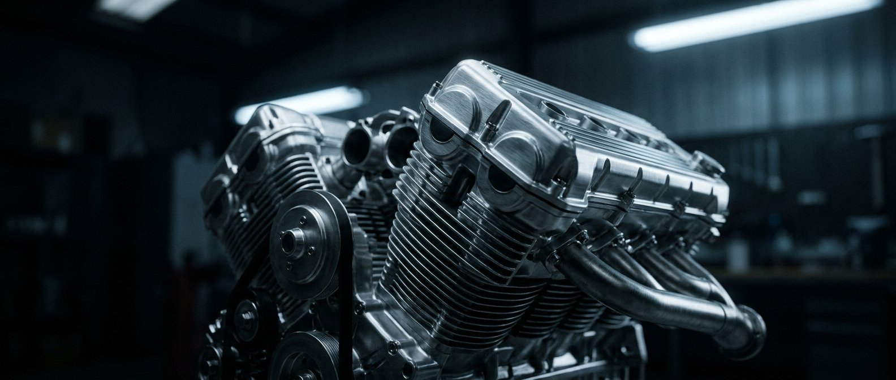

# DUMP.md — MS REPROG 75 (extraction propre pour reconstruction externe)

Site automobile : reprogrammation moteur, dépollution, fichiers à distance. 3 pages statiques (HTML/CSS/JS vanilla) + 1 fonction serverless Stripe (`/api/create-checkout-session`, hors de ce dump).

État au commit `36090f0` (2026-05-06).

---

## SECTION 1 — CONTENU EXACT DES FICHIERS

### `index.html`

```html
<!DOCTYPE html>
<html lang="fr">
<head>
<meta charset="UTF-8">
<meta name="viewport" content="width=device-width, initial-scale=1.0">
<title>MS REPROG 75 — L'art de la performance sur mesure</title>
<meta name="description" content="Reprogrammation moteur, dépollution FAP/EGR/AdBlue, Stage 1 à 3, E85. Logiciels officiels, garantie à vie. Atelier à Morangis (91) + intervention 24/7 partout en France.">
<link rel="preload" as="font" type="font/woff2" href="fonts/barlow-400.woff2" crossorigin>
<link rel="preload" as="font" type="font/woff2" href="fonts/instrument-serif-italic.woff2" crossorigin>
<link rel="stylesheet" href="styles.css">
</head>
<body>

<!-- ═══ NAVBAR ═══ -->
<nav class="navbar" id="navbar">
  <button class="nav-cart-mobile" onclick="openCartDrawer()" aria-label="Ouvrir le panier">
    <svg class="nav-cart-mobile-icon" viewBox="0 0 24 24" fill="none" stroke="currentColor" stroke-width="2"><circle cx="9" cy="21" r="1"/><circle cx="20" cy="21" r="1"/><path d="M1 1h4l2.68 13.39a2 2 0 0 0 2 1.61h9.72a2 2 0 0 0 2-1.61L23 6H6"/></svg>
    <span class="nav-cart-mobile-count">0</span>
  </button>
  <div class="nav-center">
    <div class="nav-pill liquid-glass">
      <a href="index.html" class="nav-link" aria-current="page">Accueil</a>
      <a href="boutique.html" class="nav-link">Boutique</a>
      <a href="boutique.html" class="btn-solid">Voir la boutique
        <svg class="icon-xs" viewBox="0 0 24 24" fill="none" stroke="currentColor" stroke-width="2.5" stroke-linecap="round" stroke-linejoin="round"><line x1="7" y1="17" x2="17" y2="7"/><polyline points="7 7 17 7 17 17"/></svg>
      </a>
    </div>
  </div>
  <a href="boutique.html" class="btn-solid btn-solid-mobile">Boutique
    <svg class="icon-xs" viewBox="0 0 24 24" fill="none" stroke="currentColor" stroke-width="2.5" stroke-linecap="round" stroke-linejoin="round"><line x1="7" y1="17" x2="17" y2="7"/><polyline points="7 7 17 7 17 17"/></svg>
  </a>
</nav>

<button class="cart-button" onclick="openCartDrawer()" aria-label="Ouvrir le panier" style="display:none;">
  <svg class="cart-button-icon" viewBox="0 0 24 24" fill="none" stroke="currentColor" stroke-width="2"><circle cx="9" cy="21" r="1"/><circle cx="20" cy="21" r="1"/><path d="M1 1h4l2.68 13.39a2 2 0 0 0 2 1.61h9.72a2 2 0 0 0 2-1.61L23 6H6"/></svg>
  Panier <span class="cart-button-count empty">0</span>
</button>

<!-- ═══ SECTION 1 : HERO ═══ -->
<section class="hero" id="accueil">
  <video class="hero-video" autoplay loop muted playsinline preload="metadata"
    src="https://res.cloudinary.com/duia2hrlv/video/upload/v1777925956/hf_20260504_201505_287623ab-7941-4812-9215-9272377e604a_wxrno3.mp4">
  </video>
  <div class="hero-overlay"></div>
  <div class="hero-overlay-left"></div>
  <div class="hero-content">
    <div class="hero-eyebrow liquid-glass">
      <span class="eyebrow-dot"></span>
      <span class="eyebrow-label">Garantie à vie</span>
      <span class="eyebrow-sep">·</span>
      <span class="eyebrow-meta">Reprogrammation moteur sur logiciels officiels</span>
    </div>
    <h1 class="hero-title" id="heroTitle"></h1>
    <p class="hero-sub anim-fade-up" style="animation-delay: 1.2s;">
      Reprogrammation moteur, dépollution, Stage 1 à 3, E85.<br>Atelier à Morangis (91) + intervention urgence 24/7.
    </p>
    <div class="hero-cta-row anim-fade-up" style="animation-delay: 1.4s;">
      <a href="boutique.html" class="btn-solid">Voir la boutique
        <svg class="icon-sm" viewBox="0 0 24 24" fill="none" stroke="currentColor" stroke-width="2.5" stroke-linecap="round" stroke-linejoin="round"><line x1="7" y1="17" x2="17" y2="7"/><polyline points="7 7 17 7 17 17"/></svg>
      </a>
      <a href="tel:+33601946197" class="btn-glass liquid-glass-strong">
        <svg class="icon-sm" viewBox="0 0 24 24" fill="none" stroke="currentColor" stroke-width="2" stroke-linecap="round" stroke-linejoin="round"><path d="M22 16.92v3a2 2 0 0 1-2.18 2 19.79 19.79 0 0 1-8.63-3.07 19.5 19.5 0 0 1-6-6 19.79 19.79 0 0 1-3.07-8.67A2 2 0 0 1 4.11 2h3a2 2 0 0 1 2 1.72 12.84 12.84 0 0 0 .7 2.81 2 2 0 0 1-.45 2.11L8.09 9.91a16 16 0 0 0 6 6l1.27-1.27a2 2 0 0 1 2.11-.45 12.84 12.84 0 0 0 2.81.7A2 2 0 0 1 22 16.92z"/></svg>
        Appeler l'atelier
      </a>
    </div>
    <a href="tel:+33601946197" class="hero-tel anim-fade-up" style="animation-delay: 1.6s;">
      <svg viewBox="0 0 24 24" fill="none" stroke="currentColor" stroke-width="2" stroke-linecap="round" stroke-linejoin="round"><path d="M22 16.92v3a2 2 0 0 1-2.18 2 19.79 19.79 0 0 1-8.63-3.07 19.5 19.5 0 0 1-6-6 19.79 19.79 0 0 1-3.07-8.67A2 2 0 0 1 4.11 2h3a2 2 0 0 1 2 1.72 12.84 12.84 0 0 0 .7 2.81 2 2 0 0 1-.45 2.11L8.09 9.91a16 16 0 0 0 6 6l1.27-1.27a2 2 0 0 1 2.11-.45 12.84 12.84 0 0 0 2.81.7A2 2 0 0 1 22 16.92z"/></svg>
      <span class="hero-tel-label">Urgence 24/7</span>
      <span class="hero-tel-num">+33 6 01 94 61 97</span>
    </a>
  </div>
</section>

<!-- ═══ SECTION 2 : TRUST BADGES ═══ -->
<section class="section-trust reveal">
  <div class="trust-grid">
    <div class="trust-pill liquid-glass anim-up" data-stagger="1">
      <svg class="trust-icon" viewBox="0 0 24 24" fill="none" stroke="currentColor" stroke-width="1.8" stroke-linecap="round" stroke-linejoin="round"><path d="M12 2 4 6v6c0 5 3.5 9 8 10 4.5-1 8-5 8-10V6z"/><path d="m9 12 2 2 4-4"/></svg>
      <span class="trust-label">Logiciels officiels</span>
    </div>
    <div class="trust-pill liquid-glass anim-up" data-stagger="2">
      <svg class="trust-icon" viewBox="0 0 24 24" fill="none" stroke="currentColor" stroke-width="1.8" stroke-linecap="round" stroke-linejoin="round"><circle cx="12" cy="12" r="10"/><path d="M12 6v6l4 2"/></svg>
      <span class="trust-label">Garantie à vie</span>
    </div>
    <div class="trust-pill liquid-glass anim-up" data-stagger="3">
      <svg class="trust-icon" viewBox="0 0 24 24" fill="none" stroke="currentColor" stroke-width="1.8" stroke-linecap="round" stroke-linejoin="round"><path d="M12 2v4M12 18v4M4.93 4.93l2.83 2.83M16.24 16.24l2.83 2.83M2 12h4M18 12h4M4.93 19.07l2.83-2.83M16.24 7.76l2.83-2.83"/></svg>
      <span class="trust-label">Intervention 24h/24, 7j/7</span>
    </div>
  </div>
</section>

<!-- ═══ SECTION 3 : 3 PRESTATIONS PHARES ═══ -->
<section class="section reveal" id="prestations">
  <span class="section-eyebrow anim-up" data-stagger="1">Prestations phares</span>
  <h2 class="section-heading anim-blur" data-stagger="2">Trois interventions qui changent tout.</h2>
  <p class="section-lead anim-up" data-stagger="3">
    Nos prestations les plus demandées. Pour le reste — Stage 2, IMMO OFF, clonage de calculateur, fichiers à distance pour pros — tout le catalogue est dans la <a href="boutique.html" class="link-accent-underline">boutique</a>.
  </p>

  <div class="prestations-banner anim-image" data-stagger="4">
    
    <div class="prestations-banner-overlay"></div>
    <div class="prestations-banner-caption">
      <span class="prestations-banner-label">— Précision mécanique</span>
    </div>
  </div>

  <div class="prestations-grid stagger-grid">

    <article class="prestation-card liquid-glass-strong">
      <div class="prestation-mockup">
        <div class="prestation-mockup-glow"></div>
        <svg viewBox="0 0 320 140" xmlns="http://www.w3.org/2000/svg">
          <defs>
            <linearGradient id="pwr1" x1="0" y1="1" x2="1" y2="0"><stop offset="0%" stop-color="#E8C875" stop-opacity="0"/><stop offset="100%" stop-color="#F2D88A"/></linearGradient>
            <linearGradient id="pwrFill1" x1="0" y1="0" x2="0" y2="1"><stop offset="0%" stop-color="#E8C875" stop-opacity="0.25"/><stop offset="100%" stop-color="#E8C875" stop-opacity="0"/></linearGradient>
          </defs>
          <g stroke="rgba(255,255,255,0.05)" stroke-width="0.5"><line x1="20" y1="40" x2="300" y2="40"/><line x1="20" y1="70" x2="300" y2="70"/><line x1="20" y1="100" x2="300" y2="100"/></g>
          <path d="M 20 110 Q 90 100, 140 80 T 240 35 Q 270 25, 290 40 L 290 130 L 20 130 Z" fill="url(#pwrFill1)"/>
          <path d="M 20 110 Q 90 100, 140 80 T 240 35 Q 270 25, 290 40" stroke="url(#pwr1)" stroke-width="2.5" fill="none" stroke-linecap="round"/>
          <text x="20" y="130" fill="rgba(255,255,255,0.3)" font-size="9" font-family="monospace">RPM →</text>
          <text x="280" y="130" fill="rgba(232,200,117,0.7)" font-size="9" font-family="monospace" text-anchor="end">+15-25%</text>
        </svg>
      </div>
      <div class="prestation-content">
        <span class="prestation-tag">Reprogrammation</span>
        <h3 class="prestation-title">Stage 1.</h3>
        <p class="prestation-desc">Reprogrammation moteur d'origine optimisée. Gain de couple, conduite plus souple. À partir de 250 €.</p>
        <a href="boutique.html" class="prestation-link">Voir les détails →</a>
      </div>
    </article>

    <article class="prestation-card liquid-glass-strong">
      <div class="prestation-mockup">
        <div class="prestation-mockup-glow"></div>
        <svg viewBox="0 0 320 140" xmlns="http://www.w3.org/2000/svg">
          <g stroke="rgba(232,200,117,0.45)" stroke-width="1" fill="none">
            <rect x="40" y="50" width="48" height="40" rx="4"/>
            <rect x="108" y="50" width="48" height="40" rx="4"/>
            <rect x="176" y="50" width="48" height="40" rx="4"/>
            <rect x="244" y="50" width="48" height="40" rx="4"/>
          </g>
          <text x="64" y="74" fill="rgba(232,200,117,0.7)" font-size="9" font-family="monospace" text-anchor="middle">FAP</text>
          <text x="132" y="74" fill="rgba(232,200,117,0.7)" font-size="9" font-family="monospace" text-anchor="middle">EGR</text>
          <text x="200" y="74" fill="rgba(232,200,117,0.7)" font-size="9" font-family="monospace" text-anchor="middle">λ</text>
          <text x="268" y="74" fill="rgba(232,200,117,0.7)" font-size="8" font-family="monospace" text-anchor="middle">AdBlue</text>
          <text x="160" y="115" fill="rgba(255,255,255,0.3)" font-size="8" font-family="monospace" text-anchor="middle">PACK COMPLET DÉPOLLUTION</text>
        </svg>
      </div>
      <div class="prestation-content">
        <span class="prestation-tag">Dépollution</span>
        <h3 class="prestation-title">Pack dépollution.</h3>
        <p class="prestation-desc">Suppression FAP, EGR, Lambda, AdBlue. Solution durable pour véhicules sortis de garantie. À partir de 149 €.</p>
        <a href="boutique.html" class="prestation-link">Voir les détails →</a>
      </div>
    </article>

    <article class="prestation-card liquid-glass-strong">
      <div class="prestation-mockup">
        <div class="prestation-mockup-glow"></div>
        <svg viewBox="0 0 320 140" xmlns="http://www.w3.org/2000/svg">
          <g stroke="rgba(255,255,255,0.1)" stroke-width="1" fill="none">
            <rect x="100" y="40" width="120" height="60" rx="8"/>
          </g>
          <text x="160" y="75" fill="#E8C875" font-size="28" font-family="monospace" font-weight="bold" text-anchor="middle">E85</text>
          <text x="160" y="92" fill="rgba(255,255,255,0.5)" font-size="9" font-family="monospace" text-anchor="middle">FLEX FUEL</text>
          <text x="160" y="125" fill="rgba(255,255,255,0.3)" font-size="8" font-family="monospace" text-anchor="middle">CARBURANT BIOÉTHANOL</text>
        </svg>
      </div>
      <div class="prestation-content">
        <span class="prestation-tag">Flex Fuel</span>
        <h3 class="prestation-title">Reprogrammation E85.</h3>
        <p class="prestation-desc">Conversion bioéthanol pour rouler à l'E85. Économies pompe + gain de puissance. À partir de 300 €.</p>
        <a href="boutique.html" class="prestation-link">Voir les détails →</a>
      </div>
    </article>

  </div>
</section>

<!-- ═══ SECTION 4 : POURQUOI NOUS ═══ -->
<section class="section reveal" id="pourquoi">
  <span class="section-eyebrow anim-up" data-stagger="1">Pourquoi nous choisir</span>
  <h2 class="section-heading anim-blur" data-stagger="2">Le moteur de votre voiture mérite ce niveau d'exigence.</h2>
  <p class="section-lead anim-up" data-stagger="3">
    MS REPROG 75 est une équipe de professionnels passionnés, basée en Île-de-France. Notre approche repose sur un principe simple : respecter la mécanique avant tout.
  </p>

  <div class="why-grid stagger-grid">
    <div class="why-card liquid-glass-strong">
      <svg class="why-card-icon" viewBox="0 0 24 24" fill="none" stroke="currentColor" stroke-width="1.8" stroke-linecap="round" stroke-linejoin="round"><path d="M12 2 4 6v6c0 5 3.5 9 8 10 4.5-1 8-5 8-10V6z"/><path d="m9 12 2 2 4-4"/></svg>
      <h4 class="why-card-title">Logiciels officiels.</h4>
      <p class="why-card-desc">Outils constructeur de dernière génération. Aucun bricolage : nos cartographies sont conçues pour optimiser sans dégrader la fiabilité du moteur.</p>
    </div>
    <div class="why-card liquid-glass-strong">
      <svg class="why-card-icon" viewBox="0 0 24 24" fill="none" stroke="currentColor" stroke-width="1.8" stroke-linecap="round" stroke-linejoin="round"><circle cx="12" cy="12" r="10"/><path d="M12 6v6l4 2"/></svg>
      <h4 class="why-card-title">Garantie à vie.</h4>
      <p class="why-card-desc">Toutes nos prestations en atelier sont garanties à vie. Si un problème survient lié à notre intervention, on le règle. C'est notre engagement.</p>
    </div>
    <div class="why-card liquid-glass-strong">
      <svg class="why-card-icon" viewBox="0 0 24 24" fill="none" stroke="currentColor" stroke-width="1.8" stroke-linecap="round" stroke-linejoin="round"><path d="M12 2v4M12 18v4M4.93 4.93l2.83 2.83M16.24 16.24l2.83 2.83M2 12h4M18 12h4M4.93 19.07l2.83-2.83M16.24 7.76l2.83-2.83"/></svg>
      <h4 class="why-card-title">Intervention 24/7.</h4>
      <p class="why-card-desc">Atelier à Morangis (91) pour les RDV en semaine. Et déplacement partout en France à toute heure pour les urgences. Particuliers et pros.</p>
    </div>
  </div>

  <!-- TODO HOUDINI: remplace par le vrai lien Google Maps de la fiche atelier -->
  <div class="google-reviews-cta anim-up" data-stagger="4">
    <a href="https://www.google.com/maps/search/MS+REPROG+75+Morangis" target="_blank" rel="noopener">
      <svg viewBox="0 0 24 24" fill="none" stroke="currentColor" stroke-width="1.8" stroke-linecap="round" stroke-linejoin="round" style="width:14px;height:14px;"><polygon points="12 2 15.09 8.26 22 9.27 17 14.14 18.18 21.02 12 17.77 5.82 21.02 7 14.14 2 9.27 8.91 8.26 12 2"/></svg>
      Vous nous avez fait confiance ? Laissez-nous un avis Google →
    </a>
  </div>
</section>

<!-- ═══ SECTION 5 : CTA FINAL ═══ -->
<section class="cta-final reveal">
  <div class="cta-final-content">
    <div class="cta-final-eyebrow anim-up" data-stagger="1">Prêt à passer à l'action</div>
    <h2 class="cta-final-title anim-blur" data-stagger="2">Votre véhicule mérite la précision.</h2>
    <p class="cta-final-sub anim-up" data-stagger="3">Que ce soit pour un Stage 1, une dépollution complète ou une intervention urgente, on s'occupe de tout. Réponse rapide, accueil chaleureux.</p>
    <div class="cta-final-row anim-up" data-stagger="4">
      <a href="boutique.html" class="btn-solid" style="padding: 14px 26px; font-size: 14px;">Voir nos prestations
        <svg class="icon-sm" viewBox="0 0 24 24" fill="none" stroke="currentColor" stroke-width="2.5" stroke-linecap="round" stroke-linejoin="round"><line x1="7" y1="17" x2="17" y2="7"/><polyline points="7 7 17 7 17 17"/></svg>
      </a>
      <a href="tel:+33601946197" class="cta-final-tel">
        <svg viewBox="0 0 24 24" fill="none" stroke="currentColor" stroke-width="2" stroke-linecap="round" stroke-linejoin="round"><path d="M22 16.92v3a2 2 0 0 1-2.18 2 19.79 19.79 0 0 1-8.63-3.07 19.5 19.5 0 0 1-6-6 19.79 19.79 0 0 1-3.07-8.67A2 2 0 0 1 4.11 2h3a2 2 0 0 1 2 1.72 12.84 12.84 0 0 0 .7 2.81 2 2 0 0 1-.45 2.11L8.09 9.91a16 16 0 0 0 6 6l1.27-1.27a2 2 0 0 1 2.11-.45 12.84 12.84 0 0 0 2.81.7A2 2 0 0 1 22 16.92z"/></svg>
        +33 6 01 94 61 97
      </a>
    </div>
  </div>
</section>

<!-- ═══ FOOTER (avec contact intégré) ═══ -->
<footer class="footer reveal" id="contact">
  <div class="footer-top">
    <div class="footer-brand-block anim-up" data-stagger="1">
      <h3 class="footer-brand">MS REPROG 75</h3>
      <p class="footer-tagline">L'art de la performance sur mesure.</p>
      <div class="footer-cta-row">
        <a href="tel:+33601946197">
          <svg viewBox="0 0 24 24" fill="none" stroke="currentColor" stroke-width="2"><path d="M22 16.92v3a2 2 0 0 1-2.18 2 19.79 19.79 0 0 1-8.63-3.07 19.5 19.5 0 0 1-6-6 19.79 19.79 0 0 1-3.07-8.67A2 2 0 0 1 4.11 2h3a2 2 0 0 1 2 1.72 12.84 12.84 0 0 0 .7 2.81 2 2 0 0 1-.45 2.11L8.09 9.91a16 16 0 0 0 6 6l1.27-1.27a2 2 0 0 1 2.11-.45 12.84 12.84 0 0 0 2.81.7A2 2 0 0 1 22 16.92z"/></svg>
          06 01 94 61 97
        </a>
        <a href="mailto:msreprog75@gmail.com">
          <svg viewBox="0 0 24 24" fill="none" stroke="currentColor" stroke-width="2"><path d="M4 4h16c1.1 0 2 .9 2 2v12c0 1.1-.9 2-2 2H4c-1.1 0-2-.9-2-2V6c0-1.1.9-2 2-2z"/><polyline points="22,6 12,13 2,6"/></svg>
          Email
        </a>
      </div>
    </div>
    <div class="footer-col anim-up" data-stagger="2">
      <h4 class="footer-col-title">Site</h4>
      <a href="index.html">Accueil</a>
      <a href="boutique.html">Boutique</a>
    </div>
    <div class="footer-col anim-up" data-stagger="3">
      <h4 class="footer-col-title">Atelier</h4>
      <a href="https://maps.google.com/?q=18+Avenue+de+Juvisy+91420+Morangis" target="_blank" rel="noopener">18 Avenue de Juvisy<br>91420 Morangis, France</a>
      <span class="footer-meta">Lun – Sam · 9h – 19h</span>
      <span class="footer-urgence">Urgence 24/7 · partout en France</span>
    </div>
    <div class="footer-col anim-up" data-stagger="4">
      <h4 class="footer-col-title">Réseaux</h4>
      <a href="https://www.tiktok.com/@msreprog75" target="_blank" rel="noopener">TikTok</a>
      <a href="https://snapchat.com/add/msreprog75" target="_blank" rel="noopener">Snapchat</a>
      <a href="https://facebook.com/msreprog75" target="_blank" rel="noopener">Facebook</a>
    </div>
  </div>
  <div class="footer-bottom">
    <span>© 2026 MS REPROG 75. Tous droits réservés.</span>
    <span>Conçu pour les passionnés de mécanique.</span>
  </div>
</footer>

<!-- ═══ WhatsApp FAB ═══ -->
<a href="https://wa.me/33652751882?text=Bonjour%2C%20je%20vous%20contacte%20depuis%20votre%20site." target="_blank" rel="noopener" class="whatsapp-fab" aria-label="Discuter sur WhatsApp">
  <svg viewBox="0 0 24 24" fill="currentColor"><path d="M17.472 14.382c-.297-.149-1.758-.867-2.03-.967-.273-.099-.471-.148-.67.15-.197.297-.767.966-.94 1.164-.173.199-.347.223-.644.075-.297-.15-1.255-.463-2.39-1.475-.883-.788-1.48-1.761-1.653-2.059-.173-.297-.018-.458.13-.606.134-.133.298-.347.446-.52.149-.174.198-.298.298-.497.099-.198.05-.371-.025-.52-.075-.149-.669-1.612-.916-2.207-.242-.579-.487-.5-.669-.51-.173-.008-.371-.01-.57-.01-.198 0-.52.074-.792.372-.272.297-1.04 1.016-1.04 2.479 0 1.462 1.065 2.875 1.213 3.074.149.198 2.096 3.2 5.077 4.487.709.306 1.262.489 1.694.625.712.227 1.36.195 1.871.118.571-.085 1.758-.719 2.006-1.413.248-.694.248-1.289.173-1.413-.074-.124-.272-.198-.57-.347m-5.421 7.403h-.004a9.87 9.87 0 0 1-5.031-1.378l-.361-.214-3.741.982.998-3.648-.235-.374a9.86 9.86 0 0 1-1.51-5.26c.001-5.45 4.436-9.884 9.888-9.884 2.64 0 5.122 1.03 6.988 2.898a9.825 9.825 0 0 1 2.893 6.994c-.003 5.45-4.437 9.884-9.885 9.884m8.413-18.297A11.815 11.815 0 0 0 12.05 0C5.495 0 .16 5.335.157 11.892c0 2.096.547 4.142 1.588 5.945L.057 24l6.305-1.654a11.882 11.882 0 0 0 5.683 1.448h.005c6.554 0 11.89-5.335 11.893-11.893a11.821 11.821 0 0 0-3.48-8.413Z"/></svg>
</a>

<!-- ═══ Cart Drawer ═══ -->
<div class="cart-drawer-overlay" onclick="closeCartDrawer()"></div>
<aside class="cart-drawer">
  <div class="cart-drawer-header">
    <h3 class="cart-drawer-title">Votre panier.</h3>
    <button class="cart-drawer-close" onclick="closeCartDrawer()" aria-label="Fermer">
      <svg width="22" height="22" viewBox="0 0 24 24" fill="none" stroke="currentColor" stroke-width="2"><line x1="18" y1="6" x2="6" y2="18"/><line x1="6" y1="6" x2="18" y2="18"/></svg>
    </button>
  </div>
  <div class="cart-drawer-body"></div>
  <div class="cart-drawer-footer">
    <div class="cart-total">
      <span class="cart-total-label">Total</span>
      <span class="cart-total-amount">0 €</span>
    </div>
    <button class="btn-checkout" onclick="checkout()">Procéder au paiement
      <svg class="icon-sm" viewBox="0 0 24 24" fill="none" stroke="currentColor" stroke-width="2.5"><line x1="5" y1="12" x2="19" y2="12"/><polyline points="12 5 19 12 12 19"/></svg>
    </button>
    <p class="cart-drawer-note">Paiement sécurisé via Stripe</p>
  </div>
</aside>

<script src="cart.js" defer></script>
<script>
(function() {
  const title = "Le Moteur Que Vous Méritez";
  const el = document.getElementById("heroTitle");
  const words = title.split(" ");
  const frag = document.createDocumentFragment();
  words.forEach((word, i) => {
    const span = document.createElement("span");
    span.className = "blur-word";
    span.style.animationDelay = (0.3 + i * 0.12) + "s";
    span.textContent = word;
    frag.appendChild(span);
    if (i < words.length - 1) frag.appendChild(document.createTextNode(" "));
  });
  el.appendChild(frag);
})();

let _navScrolled = false;
const navbarEl = document.getElementById("navbar");
window.addEventListener("scroll", () => {
  const next = window.scrollY > 40;
  if (next !== _navScrolled) {
    _navScrolled = next;
    navbarEl.classList.toggle("scrolled", next);
  }
}, { passive: true });

// Reveal observer — queue + 1 reveal par frame pour étaler le coût compositor en burst scroll
const _revealQueue = [];
let _revealScheduled = false;
function _processRevealQueue() {
  _revealScheduled = false;
  const el = _revealQueue.shift();
  if (el) el.classList.add("visible");
  if (_revealQueue.length) {
    _revealScheduled = true;
    requestAnimationFrame(_processRevealQueue);
  }
}
const revealObserver = new IntersectionObserver((entries) => {
  for (const entry of entries) {
    if (entry.isIntersecting) {
      _revealQueue.push(entry.target);
      revealObserver.unobserve(entry.target);
    }
  }
  if (!_revealScheduled && _revealQueue.length) {
    _revealScheduled = true;
    requestAnimationFrame(_processRevealQueue);
  }
}, { threshold: 0, rootMargin: "0px 0px 200px 0px" });
document.querySelectorAll(".reveal").forEach(el => revealObserver.observe(el));

// Force-check au load : READ batch puis WRITE batch (pas de forced sync layout en boucle)
requestAnimationFrame(() => {
  const candidates = document.querySelectorAll(".reveal:not(.visible)");
  const innerH = window.innerHeight;
  const toReveal = [];
  candidates.forEach(el => {
    const rect = el.getBoundingClientRect();
    if (rect.top < innerH && rect.bottom > 0) toReveal.push(el);
  });
  toReveal.forEach(el => {
    el.classList.add("visible");
    revealObserver.unobserve(el);
  });
});

// Pause hero video when scrolled out of view (libère décodeur GPU/CPU sur mobile)
const heroVideo = document.querySelector('.hero-video');
if (heroVideo) {
  const videoObserver = new IntersectionObserver((entries) => {
    entries.forEach(e => {
      if (e.isIntersecting) { heroVideo.play().catch(() => {}); }
      else { heroVideo.pause(); }
    });
  }, { threshold: 0.1 });
  videoObserver.observe(heroVideo);
}

// Parallax retiré : remplacé par transform CSS static sur .parallax-img (préserve l'échelle 1.05 sans handler scroll).
</script>
</body>
</html>
```

### `boutique.html`

```html
<!DOCTYPE html>
<html lang="fr">
<head>
<meta charset="UTF-8">
<meta name="viewport" content="width=device-width, initial-scale=1.0">
<title>Boutique — MS REPROG 75</title>
<meta name="description" content="Catalogue complet : 9 prestations en atelier + 5 fichiers à distance pour pros. Tarifs transparents, paiement sécurisé.">
<link rel="preload" as="font" type="font/woff2" href="fonts/barlow-400.woff2" crossorigin>
<link rel="preload" as="font" type="font/woff2" href="fonts/instrument-serif-italic.woff2" crossorigin>
<link rel="stylesheet" href="styles.css">
</head>
<body>

<nav class="navbar" id="navbar">
  <button class="nav-cart-mobile" onclick="openCartDrawer()" aria-label="Ouvrir le panier">
    <svg class="nav-cart-mobile-icon" viewBox="0 0 24 24" fill="none" stroke="currentColor" stroke-width="2"><circle cx="9" cy="21" r="1"/><circle cx="20" cy="21" r="1"/><path d="M1 1h4l2.68 13.39a2 2 0 0 0 2 1.61h9.72a2 2 0 0 0 2-1.61L23 6H6"/></svg>
    <span class="nav-cart-mobile-count">0</span>
  </button>
  <div class="nav-center">
    <div class="nav-pill liquid-glass">
      <a href="index.html" class="nav-link">Accueil</a>
      <a href="boutique.html" class="nav-link" aria-current="page">Boutique</a>
      <a href="tel:+33601946197" class="btn-solid">Appeler
        <svg class="icon-xs" viewBox="0 0 24 24" fill="none" stroke="currentColor" stroke-width="2" stroke-linecap="round" stroke-linejoin="round"><path d="M22 16.92v3a2 2 0 0 1-2.18 2 19.79 19.79 0 0 1-8.63-3.07 19.5 19.5 0 0 1-6-6 19.79 19.79 0 0 1-3.07-8.67A2 2 0 0 1 4.11 2h3a2 2 0 0 1 2 1.72 12.84 12.84 0 0 0 .7 2.81 2 2 0 0 1-.45 2.11L8.09 9.91a16 16 0 0 0 6 6l1.27-1.27a2 2 0 0 1 2.11-.45 12.84 12.84 0 0 0 2.81.7A2 2 0 0 1 22 16.92z"/></svg>
      </a>
    </div>
  </div>
  <a href="tel:+33601946197" class="btn-solid btn-solid-mobile">Appeler
    <svg class="icon-xs" viewBox="0 0 24 24" fill="none" stroke="currentColor" stroke-width="2" stroke-linecap="round" stroke-linejoin="round"><path d="M22 16.92v3a2 2 0 0 1-2.18 2 19.79 19.79 0 0 1-8.63-3.07 19.5 19.5 0 0 1-6-6 19.79 19.79 0 0 1-3.07-8.67A2 2 0 0 1 4.11 2h3a2 2 0 0 1 2 1.72 12.84 12.84 0 0 0 .7 2.81 2 2 0 0 1-.45 2.11L8.09 9.91a16 16 0 0 0 6 6l1.27-1.27a2 2 0 0 1 2.11-.45 12.84 12.84 0 0 0 2.81.7A2 2 0 0 1 22 16.92z"/></svg>
  </a>
</nav>

<button class="cart-button" onclick="openCartDrawer()" aria-label="Ouvrir le panier" style="display:none;">
  <svg class="cart-button-icon" viewBox="0 0 24 24" fill="none" stroke="currentColor" stroke-width="2"><circle cx="9" cy="21" r="1"/><circle cx="20" cy="21" r="1"/><path d="M1 1h4l2.68 13.39a2 2 0 0 0 2 1.61h9.72a2 2 0 0 0 2-1.61L23 6H6"/></svg>
  Panier <span class="cart-button-count empty">0</span>
</button>

<header class="page-header reveal">
  <span class="page-header-eyebrow anim-up" data-stagger="1">Catalogue · Tarifs transparents</span>
  <h1 class="page-header-title anim-blur" data-stagger="2">Toutes nos prestations.</h1>
  <p class="page-header-lead anim-up" data-stagger="3">
    Travail en atelier ou fichier à distance pour pros équipés. Réservez en ligne ou contactez-nous pour discuter de votre projet — paiement déclenche votre intervention.
  </p>
</header>

<section class="section reveal" style="padding-top: 0;">
  <!-- Toggle Atelier/Fichiers -->
  <div class="boutique-toggle anim-up" data-stagger="1" role="tablist">
    <button class="boutique-toggle-btn active" onclick="switchBoutique('atelier')" id="tab-atelier" role="tab" aria-selected="true">
      <svg class="boutique-toggle-icon" viewBox="0 0 24 24" fill="none" stroke="currentColor" stroke-width="2" stroke-linecap="round" stroke-linejoin="round"><path d="M14.7 6.3a1 1 0 0 0 0 1.4l1.6 1.6a1 1 0 0 0 1.4 0l3.77-3.77a6 6 0 0 1-7.94 7.94l-6.91 6.91a2.12 2.12 0 0 1-3-3l6.91-6.91a6 6 0 0 1 7.94-7.94l-3.76 3.76z"/></svg>
      En atelier
    </button>
    <button class="boutique-toggle-btn" onclick="switchBoutique('fichier')" id="tab-fichier" role="tab" aria-selected="false">
      <svg class="boutique-toggle-icon" viewBox="0 0 24 24" fill="none" stroke="currentColor" stroke-width="2" stroke-linecap="round" stroke-linejoin="round"><path d="M22 12H2"/><path d="M5.45 5.11 2 12v6a2 2 0 0 0 2 2h16a2 2 0 0 0 2-2v-6l-3.45-6.89A2 2 0 0 0 16.76 4H7.24a2 2 0 0 0-1.79 1.11z"/><path d="M6 16h.01"/><path d="M10 16h.01"/></svg>
      Fichier à distance <span style="opacity:0.6; margin-left:4px;">(pros)</span>
    </button>
  </div>

  <!-- ═══ ATELIER ═══ -->
  <div class="boutique-section active" id="section-atelier">
    <div class="catalog-grid stagger-grid">

      <article class="catalog-card liquid-glass-strong">
        <div class="catalog-card-img">
          <svg viewBox="0 0 320 200" xmlns="http://www.w3.org/2000/svg" style="width:100%;height:100%;">
            <defs><linearGradient id="curve1" x1="0" y1="1" x2="1" y2="0"><stop offset="0%" stop-color="#E8C875" stop-opacity="0"/><stop offset="100%" stop-color="#F2D88A"/></linearGradient></defs>
            <g stroke="rgba(255,255,255,0.05)" stroke-width="0.5"><line x1="20" y1="60" x2="300" y2="60"/><line x1="20" y1="100" x2="300" y2="100"/><line x1="20" y1="140" x2="300" y2="140"/></g>
            <path d="M 20 145 Q 90 115, 140 90 T 240 35 Q 270 25, 290 45" stroke="url(#curve1)" stroke-width="2.5" fill="none" stroke-linecap="round"/>
            <text x="280" y="180" fill="rgba(232,200,117,0.7)" font-size="9" font-family="monospace" text-anchor="end">+15-25%</text>
          </svg>
        </div>
        <div class="catalog-card-body">
          <div><span class="catalog-card-tag">Reprogrammation</span><h3 class="catalog-card-title" style="margin-top:8px;">Stage 1.</h3></div>
          <p class="catalog-card-desc">Reprogrammation moteur d'origine. Gain en couple et puissance, conduite plus souple. Essence et diesel.</p>
          <div class="catalog-card-footer">
            <span class="catalog-card-price">250 €</span>
            <button class="add-to-cart" data-product-id="stage1-atelier"><svg class="icon-xs" viewBox="0 0 24 24" fill="none" stroke="currentColor" stroke-width="2.5"><line x1="12" y1="5" x2="12" y2="19"/><line x1="5" y1="12" x2="19" y2="12"/></svg><span class="add-label">Ajouter</span></button>
          </div>
        </div>
      </article>

      <article class="catalog-card liquid-glass-strong">
        <div class="catalog-card-img">
          <svg viewBox="0 0 320 200" xmlns="http://www.w3.org/2000/svg" style="width:100%;height:100%;">
            <defs><linearGradient id="curve2" x1="0" y1="1" x2="1" y2="0"><stop offset="0%" stop-color="#E8C875" stop-opacity="0"/><stop offset="100%" stop-color="#F2D88A"/></linearGradient></defs>
            <g stroke="rgba(255,255,255,0.05)" stroke-width="0.5"><line x1="20" y1="60" x2="300" y2="60"/><line x1="20" y1="100" x2="300" y2="100"/><line x1="20" y1="140" x2="300" y2="140"/></g>
            <path d="M 20 140 Q 90 100, 140 70 T 240 20 Q 270 10, 290 25" stroke="url(#curve2)" stroke-width="2.5" fill="none" stroke-linecap="round"/>
            <circle cx="240" cy="20" r="3" fill="#F2D88A"/><circle cx="240" cy="20" r="6" fill="#F2D88A" fill-opacity="0.3"/>
            <text x="280" y="180" fill="rgba(232,200,117,0.7)" font-size="9" font-family="monospace" text-anchor="end">+30-40%</text>
          </svg>
        </div>
        <div class="catalog-card-body">
          <div><span class="catalog-card-tag">Reprogrammation</span><h3 class="catalog-card-title" style="margin-top:8px;">Stage 2.</h3></div>
          <p class="catalog-card-desc">Reprogrammation poussée pour véhicules avec modifications mécaniques (ligne, intercooler, admission).</p>
          <div class="catalog-card-footer">
            <span class="catalog-card-price">300 €</span>
            <button class="add-to-cart" data-product-id="stage2-atelier"><svg class="icon-xs" viewBox="0 0 24 24" fill="none" stroke="currentColor" stroke-width="2.5"><line x1="12" y1="5" x2="12" y2="19"/><line x1="5" y1="12" x2="19" y2="12"/></svg><span class="add-label">Ajouter</span></button>
          </div>
        </div>
      </article>

      <article class="catalog-card liquid-glass-strong">
        <div class="catalog-card-img">
          <svg viewBox="0 0 320 200" xmlns="http://www.w3.org/2000/svg" style="width:100%;height:100%;">
            <g stroke="rgba(255,255,255,0.1)" stroke-width="1" fill="none"><rect x="100" y="60" width="120" height="80" rx="8"/></g>
            <text x="160" y="105" fill="#E8C875" font-size="32" font-family="monospace" font-weight="bold" text-anchor="middle">E85</text>
            <text x="160" y="125" fill="rgba(255,255,255,0.5)" font-size="9" font-family="monospace" text-anchor="middle">FLEX FUEL</text>
          </svg>
        </div>
        <div class="catalog-card-body">
          <div><span class="catalog-card-tag">Flex Fuel</span><h3 class="catalog-card-title" style="margin-top:8px;">Reprogrammation E85.</h3></div>
          <p class="catalog-card-desc">Conversion bioéthanol pour rouler à l'E85. Gain de puissance et économies à la pompe.</p>
          <div class="catalog-card-footer">
            <span class="catalog-card-price">300 €</span>
            <button class="add-to-cart" data-product-id="e85-atelier"><svg class="icon-xs" viewBox="0 0 24 24" fill="none" stroke="currentColor" stroke-width="2.5"><line x1="12" y1="5" x2="12" y2="19"/><line x1="5" y1="12" x2="19" y2="12"/></svg><span class="add-label">Ajouter</span></button>
          </div>
        </div>
      </article>

      <article class="catalog-card liquid-glass-strong">
        <div class="catalog-card-img">
          <svg viewBox="0 0 320 200" xmlns="http://www.w3.org/2000/svg" style="width:100%;height:100%;">
            <g stroke="rgba(232,200,117,0.45)" stroke-width="1" fill="none">
              <rect x="50" y="80" width="50" height="40" rx="4"/><rect x="135" y="80" width="50" height="40" rx="4"/><rect x="220" y="80" width="50" height="40" rx="4"/>
            </g>
            <text x="75" y="105" fill="rgba(232,200,117,0.7)" font-size="9" font-family="monospace" text-anchor="middle">FAP</text>
            <text x="160" y="105" fill="rgba(232,200,117,0.7)" font-size="9" font-family="monospace" text-anchor="middle">EGR</text>
            <text x="245" y="105" fill="rgba(232,200,117,0.7)" font-size="9" font-family="monospace" text-anchor="middle">λ</text>
          </svg>
        </div>
        <div class="catalog-card-body">
          <div><span class="catalog-card-tag">Dépollution</span><h3 class="catalog-card-title" style="margin-top:8px;">FAP / EGR / Lambda.</h3></div>
          <p class="catalog-card-desc">Désactivation des systèmes de dépollution (FAP bouché, vanne EGR HS, sondes lambda défaillantes).</p>
          <div class="catalog-card-footer">
            <span class="catalog-card-price">149 €</span>
            <button class="add-to-cart" data-product-id="depollution-atelier"><svg class="icon-xs" viewBox="0 0 24 24" fill="none" stroke="currentColor" stroke-width="2.5"><line x1="12" y1="5" x2="12" y2="19"/><line x1="5" y1="12" x2="19" y2="12"/></svg><span class="add-label">Ajouter</span></button>
          </div>
        </div>
      </article>

      <article class="catalog-card liquid-glass-strong">
        <div class="catalog-card-img">
          <svg viewBox="0 0 320 200" xmlns="http://www.w3.org/2000/svg" style="width:100%;height:100%;">
            <g stroke="rgba(232,200,117,0.45)" stroke-width="1.2" fill="none"><rect x="80" y="60" width="160" height="80" rx="8"/></g>
            <text x="160" y="95" fill="#E8C875" font-size="22" font-family="monospace" font-weight="bold" text-anchor="middle">AdBlue</text>
            <text x="160" y="115" fill="rgba(255,255,255,0.5)" font-size="9" font-family="monospace" text-anchor="middle">+ NOX</text>
          </svg>
        </div>
        <div class="catalog-card-body">
          <div><span class="catalog-card-tag">Dépollution</span><h3 class="catalog-card-title" style="margin-top:8px;">AdBlue + NOX.</h3></div>
          <p class="catalog-card-desc">Désactivation du système AdBlue et du capteur NOX en cas de panne ou pour véhicule pro.</p>
          <div class="catalog-card-footer">
            <span class="catalog-card-price">249 €</span>
            <button class="add-to-cart" data-product-id="adblue-nox-atelier"><svg class="icon-xs" viewBox="0 0 24 24" fill="none" stroke="currentColor" stroke-width="2.5"><line x1="12" y1="5" x2="12" y2="19"/><line x1="5" y1="12" x2="19" y2="12"/></svg><span class="add-label">Ajouter</span></button>
          </div>
        </div>
      </article>

      <article class="catalog-card liquid-glass-strong">
        <div class="catalog-card-img">
          <svg viewBox="0 0 320 200" xmlns="http://www.w3.org/2000/svg" style="width:100%;height:100%;">
            <g stroke="rgba(232,200,117,0.45)" stroke-width="1" fill="none">
              <rect x="30" y="80" width="48" height="40" rx="4"/><rect x="98" y="80" width="48" height="40" rx="4"/><rect x="166" y="80" width="48" height="40" rx="4"/><rect x="234" y="80" width="48" height="40" rx="4"/>
            </g>
            <text x="54" y="105" fill="rgba(232,200,117,0.7)" font-size="9" font-family="monospace" text-anchor="middle">FAP</text>
            <text x="122" y="105" fill="rgba(232,200,117,0.7)" font-size="9" font-family="monospace" text-anchor="middle">EGR</text>
            <text x="190" y="105" fill="rgba(232,200,117,0.7)" font-size="9" font-family="monospace" text-anchor="middle">λ</text>
            <text x="258" y="105" fill="rgba(232,200,117,0.7)" font-size="8" font-family="monospace" text-anchor="middle">AdBlue</text>
          </svg>
        </div>
        <div class="catalog-card-body">
          <div><span class="catalog-card-tag">Pack complet</span><h3 class="catalog-card-title" style="margin-top:8px;">AdBlue + FAP / EGR / λ.</h3></div>
          <p class="catalog-card-desc">Pack complet de désactivation des systèmes antipollution. Solution tout-en-un.</p>
          <div class="catalog-card-footer">
            <span class="catalog-card-price">299 €</span>
            <button class="add-to-cart" data-product-id="adblue-fap-atelier"><svg class="icon-xs" viewBox="0 0 24 24" fill="none" stroke="currentColor" stroke-width="2.5"><line x1="12" y1="5" x2="12" y2="19"/><line x1="5" y1="12" x2="19" y2="12"/></svg><span class="add-label">Ajouter</span></button>
          </div>
        </div>
      </article>

      <article class="catalog-card liquid-glass-strong">
        <div class="catalog-card-img">
          <svg viewBox="0 0 320 200" xmlns="http://www.w3.org/2000/svg" style="width:100%;height:100%;">
            <g stroke="rgba(255,255,255,0.15)" stroke-width="1.2" fill="none"><rect x="100" y="70" width="120" height="60" rx="6"/></g>
            <g transform="translate(160, 100)"><circle r="20" fill="none" stroke="rgba(232,200,117,0.5)" stroke-width="1.5"/><text y="6" fill="#E8C875" font-size="18" font-family="monospace" text-anchor="middle">🔓</text></g>
            <text x="160" y="155" fill="rgba(232,200,117,0.7)" font-size="11" font-family="monospace" font-weight="bold" text-anchor="middle">IMMO · OFF</text>
          </svg>
        </div>
        <div class="catalog-card-body">
          <div><span class="catalog-card-tag">Électronique</span><h3 class="catalog-card-title" style="margin-top:8px;">IMMO OFF.</h3></div>
          <p class="catalog-card-desc">Désactivation antidémarrage en cas de clé perdue, calculateur HS ou changement sans appairage.</p>
          <div class="catalog-card-footer">
            <span class="catalog-card-price">169 €</span>
            <button class="add-to-cart" data-product-id="immo-off-atelier"><svg class="icon-xs" viewBox="0 0 24 24" fill="none" stroke="currentColor" stroke-width="2.5"><line x1="12" y1="5" x2="12" y2="19"/><line x1="5" y1="12" x2="19" y2="12"/></svg><span class="add-label">Ajouter</span></button>
          </div>
        </div>
      </article>

      <article class="catalog-card liquid-glass-strong">
        <div class="catalog-card-img">
          <svg viewBox="0 0 320 200" xmlns="http://www.w3.org/2000/svg" style="width:100%;height:100%;">
            <g stroke="rgba(255,255,255,0.15)" stroke-width="1" fill="none"><rect x="60" y="60" width="200" height="80" rx="6"/></g>
            <g stroke="rgba(232,200,117,0.45)" stroke-width="1" fill="rgba(232,200,117,0.05)">
              <rect x="80" y="80" width="20" height="14" rx="1"/><rect x="110" y="80" width="20" height="14" rx="1"/><rect x="140" y="80" width="20" height="14" rx="1"/>
              <rect x="170" y="80" width="20" height="14" rx="1"/><rect x="200" y="80" width="20" height="14" rx="1"/><rect x="230" y="80" width="20" height="14" rx="1"/>
            </g>
            <text x="160" y="170" fill="rgba(255,255,255,0.3)" font-size="8" font-family="monospace" text-anchor="middle">CALCULATEUR · BMW FRM</text>
          </svg>
        </div>
        <div class="catalog-card-body">
          <div><span class="catalog-card-tag">Électronique BMW</span><h3 class="catalog-card-title" style="margin-top:8px;">Réparation FRM.</h3></div>
          <p class="catalog-card-desc">Réparation du module FRM (Footwell Module) sur BMW : panne courante affectant l'éclairage et les vitres.</p>
          <div class="catalog-card-footer">
            <span class="catalog-card-price">149 €</span>
            <button class="add-to-cart" data-product-id="reparation-frm"><svg class="icon-xs" viewBox="0 0 24 24" fill="none" stroke="currentColor" stroke-width="2.5"><line x1="12" y1="5" x2="12" y2="19"/><line x1="5" y1="12" x2="19" y2="12"/></svg><span class="add-label">Ajouter</span></button>
          </div>
        </div>
      </article>

      <article class="catalog-card liquid-glass-strong">
        <div class="catalog-card-img">
          <svg viewBox="0 0 320 200" xmlns="http://www.w3.org/2000/svg" style="width:100%;height:100%;">
            <g stroke="rgba(255,255,255,0.15)" stroke-width="1" fill="none"><rect x="40" y="70" width="100" height="60" rx="5"/><rect x="180" y="70" width="100" height="60" rx="5"/></g>
            <text x="90" y="105" fill="rgba(255,255,255,0.6)" font-size="10" font-family="monospace" text-anchor="middle">SOURCE</text>
            <text x="230" y="105" fill="#E8C875" font-size="10" font-family="monospace" font-weight="bold" text-anchor="middle">CLONE</text>
            <g stroke="rgba(232,200,117,0.7)" stroke-width="1.5"><line x1="140" y1="100" x2="180" y2="100" stroke-dasharray="4,4"/><polygon points="172,96 180,100 172,104" fill="rgba(232,200,117,0.7)"/></g>
          </svg>
        </div>
        <div class="catalog-card-body">
          <div><span class="catalog-card-tag">Électronique</span><h3 class="catalog-card-title" style="margin-top:8px;">Clonage de calculateur.</h3></div>
          <p class="catalog-card-desc">Copie identique du calculateur d'origine vers un calculateur de remplacement, sans repasser par la clé.</p>
          <div class="catalog-card-footer">
            <span class="catalog-card-price">199 €</span>
            <button class="add-to-cart" data-product-id="clonage-calculateur"><svg class="icon-xs" viewBox="0 0 24 24" fill="none" stroke="currentColor" stroke-width="2.5"><line x1="12" y1="5" x2="12" y2="19"/><line x1="5" y1="12" x2="19" y2="12"/></svg><span class="add-label">Ajouter</span></button>
          </div>
        </div>
      </article>

    </div>
  </div>

  <!-- ═══ FICHIERS À DISTANCE ═══ -->
  <div class="boutique-section" id="section-fichier">
    <div class="liquid-glass-strong anim-up" data-stagger="1" style="border-radius: var(--radius-card); padding: 24px 28px; margin-bottom: 32px; display: flex; gap: 16px; align-items: flex-start;">
      <svg viewBox="0 0 24 24" fill="none" stroke="currentColor" stroke-width="1.8" stroke-linecap="round" stroke-linejoin="round" style="width:24px;height:24px;color:var(--accent);flex-shrink:0;margin-top:2px;"><circle cx="12" cy="12" r="10"/><line x1="12" y1="16" x2="12" y2="12"/><line x1="12" y1="8" x2="12.01" y2="8"/></svg>
      <div>
        <strong style="color:#fff;font-size:14px;">Service réservé aux pros équipés.</strong>
        <p style="color:var(--text-tertiary);font-size:13px;line-height:1.6;margin-top:4px;">Vous travaillez avec votre matériel (KESS, MPPS, Autotuner…). Après paiement, envoyez-nous le fichier original par email. Réponse sous 24h.</p>
      </div>
    </div>

    <div class="catalog-grid stagger-grid">

      <article class="catalog-card liquid-glass-strong">
        <div class="catalog-card-img">
          <svg viewBox="0 0 320 200" xmlns="http://www.w3.org/2000/svg" style="width:100%;height:100%;">
            <g stroke="rgba(232,200,117,0.45)" stroke-width="1.5" fill="none"><rect x="100" y="70" width="120" height="60" rx="8"/></g>
            <text x="160" y="105" fill="#E8C875" font-size="26" font-family="monospace" font-weight="bold" text-anchor="middle">EGR</text>
            <text x="220" y="50" fill="rgba(232,200,117,0.7)" font-size="8" font-family="monospace" text-anchor="middle">OFF</text>
          </svg>
        </div>
        <div class="catalog-card-body">
          <div><span class="catalog-card-tag">Fichier · Distance</span><h3 class="catalog-card-title" style="margin-top:8px;">EGR OFF.</h3></div>
          <p class="catalog-card-desc">Désactivation de la vanne EGR par fichier flashable.</p>
          <div class="catalog-card-footer">
            <span class="catalog-card-price">30 €</span>
            <button class="add-to-cart" data-product-id="egr-off-fichier"><svg class="icon-xs" viewBox="0 0 24 24" fill="none" stroke="currentColor" stroke-width="2.5"><line x1="12" y1="5" x2="12" y2="19"/><line x1="5" y1="12" x2="19" y2="12"/></svg><span class="add-label">Ajouter</span></button>
          </div>
        </div>
      </article>

      <article class="catalog-card liquid-glass-strong">
        <div class="catalog-card-img">
          <svg viewBox="0 0 320 200" xmlns="http://www.w3.org/2000/svg" style="width:100%;height:100%;">
            <g stroke="rgba(232,200,117,0.45)" stroke-width="1.5" fill="none"><rect x="100" y="70" width="120" height="60" rx="8"/></g>
            <text x="160" y="105" fill="#E8C875" font-size="26" font-family="monospace" font-weight="bold" text-anchor="middle">FAP</text>
            <text x="220" y="50" fill="rgba(232,200,117,0.7)" font-size="8" font-family="monospace" text-anchor="middle">OFF</text>
          </svg>
        </div>
        <div class="catalog-card-body">
          <div><span class="catalog-card-tag">Fichier · Distance</span><h3 class="catalog-card-title" style="margin-top:8px;">FAP OFF.</h3></div>
          <p class="catalog-card-desc">Désactivation du filtre à particules par fichier. Indispensable lors de la suppression physique d'un FAP.</p>
          <div class="catalog-card-footer">
            <span class="catalog-card-price">40 €</span>
            <button class="add-to-cart" data-product-id="fap-off-fichier"><svg class="icon-xs" viewBox="0 0 24 24" fill="none" stroke="currentColor" stroke-width="2.5"><line x1="12" y1="5" x2="12" y2="19"/><line x1="5" y1="12" x2="19" y2="12"/></svg><span class="add-label">Ajouter</span></button>
          </div>
        </div>
      </article>

      <article class="catalog-card liquid-glass-strong">
        <div class="catalog-card-img">
          <svg viewBox="0 0 320 200" xmlns="http://www.w3.org/2000/svg" style="width:100%;height:100%;">
            <g stroke="rgba(232,200,117,0.45)" stroke-width="1.5" fill="none"><rect x="100" y="70" width="120" height="60" rx="8"/></g>
            <text x="160" y="100" fill="#E8C875" font-size="20" font-family="monospace" font-weight="bold" text-anchor="middle">IMMO</text>
            <text x="160" y="120" fill="rgba(232,200,117,0.7)" font-size="11" font-family="monospace" text-anchor="middle">· OFF ·</text>
          </svg>
        </div>
        <div class="catalog-card-body">
          <div><span class="catalog-card-tag">Fichier · Distance</span><h3 class="catalog-card-title" style="margin-top:8px;">IMMO OFF.</h3></div>
          <p class="catalog-card-desc">Désactivation de l'antidémarrage par fichier. Pour calculateurs de remplacement, clés perdues.</p>
          <div class="catalog-card-footer">
            <span class="catalog-card-price">50 €</span>
            <button class="add-to-cart" data-product-id="immo-off-fichier"><svg class="icon-xs" viewBox="0 0 24 24" fill="none" stroke="currentColor" stroke-width="2.5"><line x1="12" y1="5" x2="12" y2="19"/><line x1="5" y1="12" x2="19" y2="12"/></svg><span class="add-label">Ajouter</span></button>
          </div>
        </div>
      </article>

      <article class="catalog-card liquid-glass-strong">
        <div class="catalog-card-img">
          <svg viewBox="0 0 320 200" xmlns="http://www.w3.org/2000/svg" style="width:100%;height:100%;">
            <g stroke="rgba(232,200,117,0.45)" stroke-width="1.5" fill="none"><rect x="80" y="70" width="160" height="60" rx="8"/></g>
            <text x="160" y="105" fill="#E8C875" font-size="22" font-family="monospace" font-weight="bold" text-anchor="middle">AdBlue</text>
            <text x="225" y="50" fill="rgba(232,200,117,0.7)" font-size="8" font-family="monospace" text-anchor="middle">OFF</text>
          </svg>
        </div>
        <div class="catalog-card-body">
          <div><span class="catalog-card-tag">Fichier · Distance</span><h3 class="catalog-card-title" style="margin-top:8px;">AdBlue OFF.</h3></div>
          <p class="catalog-card-desc">Désactivation du système AdBlue par fichier. Pour véhicules pro ou pannes du système SCR.</p>
          <div class="catalog-card-footer">
            <span class="catalog-card-price">50 €</span>
            <button class="add-to-cart" data-product-id="adblue-off-fichier"><svg class="icon-xs" viewBox="0 0 24 24" fill="none" stroke="currentColor" stroke-width="2.5"><line x1="12" y1="5" x2="12" y2="19"/><line x1="5" y1="12" x2="19" y2="12"/></svg><span class="add-label">Ajouter</span></button>
          </div>
        </div>
      </article>

      <article class="catalog-card liquid-glass-strong">
        <div class="catalog-card-img">
          <svg viewBox="0 0 320 200" xmlns="http://www.w3.org/2000/svg" style="width:100%;height:100%;">
            <defs><linearGradient id="curveF" x1="0" y1="1" x2="1" y2="0"><stop offset="0%" stop-color="#E8C875" stop-opacity="0"/><stop offset="100%" stop-color="#F2D88A"/></linearGradient></defs>
            <g stroke="rgba(255,255,255,0.05)" stroke-width="0.5"><line x1="20" y1="60" x2="300" y2="60"/><line x1="20" y1="100" x2="300" y2="100"/><line x1="20" y1="140" x2="300" y2="140"/></g>
            <path d="M 20 145 Q 90 115, 140 90 T 240 35 Q 270 25, 290 45" stroke="url(#curveF)" stroke-width="2.5" fill="none" stroke-linecap="round"/>
            <text x="280" y="180" fill="rgba(232,200,117,0.7)" font-size="9" font-family="monospace" text-anchor="end">STAGE 1</text>
          </svg>
        </div>
        <div class="catalog-card-body">
          <div><span class="catalog-card-tag">Fichier · Distance</span><h3 class="catalog-card-title" style="margin-top:8px;">Stage 1 (fichier).</h3></div>
          <p class="catalog-card-desc">Fichier de reprogrammation Stage 1 prêt à flasher. Pour pros équipés (interface, lecteur ECU).</p>
          <div class="catalog-card-footer">
            <span class="catalog-card-price">70 €</span>
            <button class="add-to-cart" data-product-id="stage1-fichier"><svg class="icon-xs" viewBox="0 0 24 24" fill="none" stroke="currentColor" stroke-width="2.5"><line x1="12" y1="5" x2="12" y2="19"/><line x1="5" y1="12" x2="19" y2="12"/></svg><span class="add-label">Ajouter</span></button>
          </div>
        </div>
      </article>

    </div>
  </div>
</section>

<!-- INFO BAND -->
<section class="section reveal" style="padding-top: 0;">
  <div class="liquid-glass-strong info-band">
    <div>
      <span class="section-eyebrow anim-up" data-stagger="1">Bon à savoir</span>
      <h3 class="anim-blur" data-stagger="2" style="font-family: var(--font-heading); font-style: italic; font-size: clamp(1.8rem, 3vw, 2.5rem); line-height: 1.05; letter-spacing: -1px; color: #fff; margin: 16px 0;">Garantie à vie sur l'atelier. Réponse 24h sur les fichiers.</h3>
      <p class="anim-up" data-stagger="3" style="color: var(--text-secondary); font-size: 15px; line-height: 1.7;">Le paiement réserve votre intervention atelier ou déclenche la livraison de votre fichier. Pour toute question avant achat, contactez-nous.</p>
    </div>
    <div class="anim-up" data-stagger="4" style="display: flex; flex-direction: column; gap: 14px; align-items: flex-start;">
      <a href="tel:+33601946197" class="btn-submit" style="margin-top: 0;">Appeler l'atelier
        <svg class="icon-sm" viewBox="0 0 24 24" fill="none" stroke="currentColor" stroke-width="2.5" stroke-linecap="round" stroke-linejoin="round"><path d="M22 16.92v3a2 2 0 0 1-2.18 2 19.79 19.79 0 0 1-8.63-3.07 19.5 19.5 0 0 1-6-6 19.79 19.79 0 0 1-3.07-8.67A2 2 0 0 1 4.11 2h3a2 2 0 0 1 2 1.72 12.84 12.84 0 0 0 .7 2.81 2 2 0 0 1-.45 2.11L8.09 9.91a16 16 0 0 0 6 6l1.27-1.27a2 2 0 0 1 2.11-.45 12.84 12.84 0 0 0 2.81.7A2 2 0 0 1 22 16.92z"/></svg>
      </a>
    </div>
  </div>
</section>

<footer class="footer reveal">
  <div class="footer-top">
    <div class="footer-brand-block anim-up" data-stagger="1">
      <h3 class="footer-brand">MS REPROG 75</h3>
      <p class="footer-tagline">L'art de la performance sur mesure.</p>
      <div class="footer-cta-row">
        <a href="tel:+33601946197"><svg viewBox="0 0 24 24" fill="none" stroke="currentColor" stroke-width="2"><path d="M22 16.92v3a2 2 0 0 1-2.18 2 19.79 19.79 0 0 1-8.63-3.07 19.5 19.5 0 0 1-6-6 19.79 19.79 0 0 1-3.07-8.67A2 2 0 0 1 4.11 2h3a2 2 0 0 1 2 1.72 12.84 12.84 0 0 0 .7 2.81 2 2 0 0 1-.45 2.11L8.09 9.91a16 16 0 0 0 6 6l1.27-1.27a2 2 0 0 1 2.11-.45 12.84 12.84 0 0 0 2.81.7A2 2 0 0 1 22 16.92z"/></svg>06 01 94 61 97</a>
        <a href="mailto:msreprog75@gmail.com"><svg viewBox="0 0 24 24" fill="none" stroke="currentColor" stroke-width="2"><path d="M4 4h16c1.1 0 2 .9 2 2v12c0 1.1-.9 2-2 2H4c-1.1 0-2-.9-2-2V6c0-1.1.9-2 2-2z"/><polyline points="22,6 12,13 2,6"/></svg>Email</a>
      </div>
    </div>
    <div class="footer-col anim-up" data-stagger="2"><h4 class="footer-col-title">Site</h4><a href="index.html">Accueil</a><a href="boutique.html">Boutique</a></div>
    <div class="footer-col anim-up" data-stagger="3"><h4 class="footer-col-title">Atelier</h4><a href="https://maps.google.com/?q=18+Avenue+de+Juvisy+91420+Morangis" target="_blank" rel="noopener">18 Avenue de Juvisy<br>91420 Morangis</a><span class="footer-meta">Lun – Sam · 9h – 19h</span><span class="footer-urgence">Urgence 24/7</span></div>
    <div class="footer-col anim-up" data-stagger="4"><h4 class="footer-col-title">Réseaux</h4><a href="https://www.tiktok.com/@msreprog75" target="_blank" rel="noopener">TikTok</a><a href="https://snapchat.com/add/msreprog75" target="_blank" rel="noopener">Snapchat</a><a href="https://facebook.com/msreprog75" target="_blank" rel="noopener">Facebook</a></div>
  </div>
  <div class="footer-bottom"><span>© 2026 MS REPROG 75. Tous droits réservés.</span><span>Conçu pour les passionnés de mécanique.</span></div>
</footer>

<a href="https://wa.me/33652751882?text=Bonjour%2C%20je%20vous%20contacte%20depuis%20votre%20site." target="_blank" rel="noopener" class="whatsapp-fab" aria-label="WhatsApp">
  <svg viewBox="0 0 24 24" fill="currentColor"><path d="M17.472 14.382c-.297-.149-1.758-.867-2.03-.967-.273-.099-.471-.148-.67.15-.197.297-.767.966-.94 1.164-.173.199-.347.223-.644.075-.297-.15-1.255-.463-2.39-1.475-.883-.788-1.48-1.761-1.653-2.059-.173-.297-.018-.458.13-.606.134-.133.298-.347.446-.52.149-.174.198-.298.298-.497.099-.198.05-.371-.025-.52-.075-.149-.669-1.612-.916-2.207-.242-.579-.487-.5-.669-.51-.173-.008-.371-.01-.57-.01-.198 0-.52.074-.792.372-.272.297-1.04 1.016-1.04 2.479 0 1.462 1.065 2.875 1.213 3.074.149.198 2.096 3.2 5.077 4.487.709.306 1.262.489 1.694.625.712.227 1.36.195 1.871.118.571-.085 1.758-.719 2.006-1.413.248-.694.248-1.289.173-1.413-.074-.124-.272-.198-.57-.347m-5.421 7.403h-.004a9.87 9.87 0 0 1-5.031-1.378l-.361-.214-3.741.982.998-3.648-.235-.374a9.86 9.86 0 0 1-1.51-5.26c.001-5.45 4.436-9.884 9.888-9.884 2.64 0 5.122 1.03 6.988 2.898a9.825 9.825 0 0 1 2.893 6.994c-.003 5.45-4.437 9.884-9.885 9.884m8.413-18.297A11.815 11.815 0 0 0 12.05 0C5.495 0 .16 5.335.157 11.892c0 2.096.547 4.142 1.588 5.945L.057 24l6.305-1.654a11.882 11.882 0 0 0 5.683 1.448h.005c6.554 0 11.89-5.335 11.893-11.893a11.821 11.821 0 0 0-3.48-8.413Z"/></svg>
</a>

<div class="cart-drawer-overlay" onclick="closeCartDrawer()"></div>
<aside class="cart-drawer">
  <div class="cart-drawer-header">
    <h3 class="cart-drawer-title">Votre panier.</h3>
    <button class="cart-drawer-close" onclick="closeCartDrawer()" aria-label="Fermer"><svg width="22" height="22" viewBox="0 0 24 24" fill="none" stroke="currentColor" stroke-width="2"><line x1="18" y1="6" x2="6" y2="18"/><line x1="6" y1="6" x2="18" y2="18"/></svg></button>
  </div>
  <div class="cart-drawer-body"></div>
  <div class="cart-drawer-footer">
    <div class="cart-total"><span class="cart-total-label">Total</span><span class="cart-total-amount">0 €</span></div>
    <button class="btn-checkout" onclick="checkout()">Procéder au paiement <svg class="icon-sm" viewBox="0 0 24 24" fill="none" stroke="currentColor" stroke-width="2.5"><line x1="5" y1="12" x2="19" y2="12"/><polyline points="12 5 19 12 12 19"/></svg></button>
    <p class="cart-drawer-note">Paiement sécurisé via Stripe</p>
  </div>
</aside>

<script src="cart.js" defer></script>
<script>
function switchBoutique(target) {
  document.querySelectorAll('.boutique-toggle-btn').forEach(b => b.classList.remove('active'));
  document.getElementById('tab-' + target).classList.add('active');
  document.querySelectorAll('.boutique-section').forEach(s => s.classList.remove('active'));
  document.getElementById('section-' + target).classList.add('active');
  document.querySelectorAll('#section-' + target + ' .reveal:not(.visible)').forEach(el => el.classList.add('visible'));
}

let _navScrolled = false;
const navbarEl = document.getElementById("navbar");
window.addEventListener("scroll", () => {
  const next = window.scrollY > 40;
  if (next !== _navScrolled) {
    _navScrolled = next;
    navbarEl.classList.toggle("scrolled", next);
  }
}, { passive: true });

// Reveal observer — queue + 1 reveal par frame pour étaler le coût compositor en burst scroll
const _revealQueue = [];
let _revealScheduled = false;
function _processRevealQueue() {
  _revealScheduled = false;
  const el = _revealQueue.shift();
  if (el) el.classList.add("visible");
  if (_revealQueue.length) {
    _revealScheduled = true;
    requestAnimationFrame(_processRevealQueue);
  }
}
const revealObserver = new IntersectionObserver((entries) => {
  for (const entry of entries) {
    if (entry.isIntersecting) {
      _revealQueue.push(entry.target);
      revealObserver.unobserve(entry.target);
    }
  }
  if (!_revealScheduled && _revealQueue.length) {
    _revealScheduled = true;
    requestAnimationFrame(_processRevealQueue);
  }
}, { threshold: 0, rootMargin: "0px 0px 200px 0px" });
document.querySelectorAll(".reveal").forEach(el => revealObserver.observe(el));

// Force-check au load : READ batch puis WRITE batch (pas de forced sync layout en boucle)
requestAnimationFrame(() => {
  const candidates = document.querySelectorAll(".reveal:not(.visible)");
  const innerH = window.innerHeight;
  const toReveal = [];
  candidates.forEach(el => {
    const rect = el.getBoundingClientRect();
    if (rect.top < innerH && rect.bottom > 0) toReveal.push(el);
  });
  toReveal.forEach(el => {
    el.classList.add("visible");
    revealObserver.unobserve(el);
  });
});
</script>
</body>
</html>
```

### `merci.html`

```html
<!DOCTYPE html>
<html lang="fr">
<head>
<meta charset="UTF-8">
<meta name="viewport" content="width=device-width, initial-scale=1.0">
<title>Merci — MS REPROG 75</title>
<link rel="preload" as="font" type="font/woff2" href="fonts/barlow-400.woff2" crossorigin>
<link rel="preload" as="font" type="font/woff2" href="fonts/instrument-serif-italic.woff2" crossorigin>
<link rel="stylesheet" href="styles.css">
</head>
<body>

<nav class="navbar" id="navbar">
  <div class="nav-center">
    <div class="nav-pill liquid-glass">
      <a href="index.html" class="nav-link">Accueil</a>
      <a href="boutique.html" class="nav-link">Boutique</a>
      <a href="boutique.html" class="btn-solid">Voir la boutique
        <svg class="icon-xs" viewBox="0 0 24 24" fill="none" stroke="currentColor" stroke-width="2.5" stroke-linecap="round" stroke-linejoin="round"><line x1="7" y1="17" x2="17" y2="7"/><polyline points="7 7 17 7 17 17"/></svg>
      </a>
    </div>
  </div>
  <a href="index.html" class="btn-solid btn-solid-mobile">Accueil</a>
</nav>

<section class="merci-section reveal">
  <div class="merci-content">
    <svg class="merci-icon anim-scale" data-stagger="1" viewBox="0 0 24 24" fill="none" stroke="currentColor" stroke-width="1.5" stroke-linecap="round" stroke-linejoin="round">
      <circle cx="12" cy="12" r="10"/>
      <polyline points="9 12 11 14 15 10"/>
    </svg>
    <h1 class="merci-title anim-blur" data-stagger="2">Merci pour votre confiance.</h1>
    <p class="merci-lead anim-up" data-stagger="3">
      Votre paiement a été reçu. Vous allez recevoir un email de confirmation dans les prochaines minutes. Notre équipe vous recontacte sous 24h pour organiser votre intervention ou la livraison de votre fichier.
    </p>
    <div class="anim-up" data-stagger="4" style="display: flex; gap: 12px; justify-content: center; flex-wrap: wrap;">
      <a href="index.html" class="btn-submit" style="margin-top: 0;">Retour à l'accueil
        <svg class="icon-sm" viewBox="0 0 24 24" fill="none" stroke="currentColor" stroke-width="2.5"><line x1="5" y1="12" x2="19" y2="12"/><polyline points="12 5 19 12 12 19"/></svg>
      </a>
      <a href="boutique.html" class="btn-glass liquid-glass-strong">
        <svg class="icon-sm" viewBox="0 0 24 24" fill="none" stroke="currentColor" stroke-width="2" stroke-linecap="round" stroke-linejoin="round"><line x1="7" y1="17" x2="17" y2="7"/><polyline points="7 7 17 7 17 17"/></svg>
        Voir la boutique
      </a>
    </div>
  </div>
</section>

<footer class="footer reveal">
  <div class="footer-top">
    <div class="footer-brand-block anim-up" data-stagger="1">
      <h3 class="footer-brand">MS REPROG 75</h3>
      <p class="footer-tagline">L'art de la performance sur mesure.</p>
      <div class="footer-cta-row">
        <a href="tel:+33601946197"><svg viewBox="0 0 24 24" fill="none" stroke="currentColor" stroke-width="2"><path d="M22 16.92v3a2 2 0 0 1-2.18 2 19.79 19.79 0 0 1-8.63-3.07 19.5 19.5 0 0 1-6-6 19.79 19.79 0 0 1-3.07-8.67A2 2 0 0 1 4.11 2h3a2 2 0 0 1 2 1.72 12.84 12.84 0 0 0 .7 2.81 2 2 0 0 1-.45 2.11L8.09 9.91a16 16 0 0 0 6 6l1.27-1.27a2 2 0 0 1 2.11-.45 12.84 12.84 0 0 0 2.81.7A2 2 0 0 1 22 16.92z"/></svg>06 01 94 61 97</a>
        <a href="mailto:msreprog75@gmail.com"><svg viewBox="0 0 24 24" fill="none" stroke="currentColor" stroke-width="2"><path d="M4 4h16c1.1 0 2 .9 2 2v12c0 1.1-.9 2-2 2H4c-1.1 0-2-.9-2-2V6c0-1.1.9-2 2-2z"/><polyline points="22,6 12,13 2,6"/></svg>Email</a>
      </div>
    </div>
    <div class="footer-col anim-up" data-stagger="2"><h4 class="footer-col-title">Site</h4><a href="index.html">Accueil</a><a href="boutique.html">Boutique</a></div>
    <div class="footer-col anim-up" data-stagger="3"><h4 class="footer-col-title">Atelier</h4><a href="https://maps.google.com/?q=18+Avenue+de+Juvisy+91420+Morangis" target="_blank" rel="noopener">18 Avenue de Juvisy<br>91420 Morangis</a><span class="footer-meta">Lun – Sam · 9h – 19h</span><span class="footer-urgence">Urgence 24/7</span></div>
    <div class="footer-col anim-up" data-stagger="4"><h4 class="footer-col-title">Réseaux</h4><a href="https://www.tiktok.com/@msreprog75" target="_blank" rel="noopener">TikTok</a><a href="https://snapchat.com/add/msreprog75" target="_blank" rel="noopener">Snapchat</a><a href="https://facebook.com/msreprog75" target="_blank" rel="noopener">Facebook</a></div>
  </div>
  <div class="footer-bottom"><span>© 2026 MS REPROG 75. Tous droits réservés.</span></div>
</footer>

<a href="https://wa.me/33652751882?text=Bonjour%2C%20je%20vous%20contacte%20depuis%20votre%20site." target="_blank" rel="noopener" class="whatsapp-fab" aria-label="WhatsApp">
  <svg viewBox="0 0 24 24" fill="currentColor"><path d="M17.472 14.382c-.297-.149-1.758-.867-2.03-.967-.273-.099-.471-.148-.67.15-.197.297-.767.966-.94 1.164-.173.199-.347.223-.644.075-.297-.15-1.255-.463-2.39-1.475-.883-.788-1.48-1.761-1.653-2.059-.173-.297-.018-.458.13-.606.134-.133.298-.347.446-.52.149-.174.198-.298.298-.497.099-.198.05-.371-.025-.52-.075-.149-.669-1.612-.916-2.207-.242-.579-.487-.5-.669-.51-.173-.008-.371-.01-.57-.01-.198 0-.52.074-.792.372-.272.297-1.04 1.016-1.04 2.479 0 1.462 1.065 2.875 1.213 3.074.149.198 2.096 3.2 5.077 4.487.709.306 1.262.489 1.694.625.712.227 1.36.195 1.871.118.571-.085 1.758-.719 2.006-1.413.248-.694.248-1.289.173-1.413-.074-.124-.272-.198-.57-.347m-5.421 7.403h-.004a9.87 9.87 0 0 1-5.031-1.378l-.361-.214-3.741.982.998-3.648-.235-.374a9.86 9.86 0 0 1-1.51-5.26c.001-5.45 4.436-9.884 9.888-9.884 2.64 0 5.122 1.03 6.988 2.898a9.825 9.825 0 0 1 2.893 6.994c-.003 5.45-4.437 9.884-9.885 9.884m8.413-18.297A11.815 11.815 0 0 0 12.05 0C5.495 0 .16 5.335.157 11.892c0 2.096.547 4.142 1.588 5.945L.057 24l6.305-1.654a11.882 11.882 0 0 0 5.683 1.448h.005c6.554 0 11.89-5.335 11.893-11.893a11.821 11.821 0 0 0-3.48-8.413Z"/></svg>
</a>

<script>
sessionStorage.removeItem('msreprog_cart');
let _navScrolled = false;
const navbarEl = document.getElementById("navbar");
window.addEventListener("scroll", () => {
  const next = window.scrollY > 40;
  if (next !== _navScrolled) {
    _navScrolled = next;
    navbarEl.classList.toggle("scrolled", next);
  }
}, { passive: true });

// Reveal observer — queue + 1 reveal par frame pour étaler le coût compositor
const _revealQueue = [];
let _revealScheduled = false;
function _processRevealQueue() {
  _revealScheduled = false;
  const el = _revealQueue.shift();
  if (el) el.classList.add("visible");
  if (_revealQueue.length) {
    _revealScheduled = true;
    requestAnimationFrame(_processRevealQueue);
  }
}
const revealObserver = new IntersectionObserver((entries) => {
  for (const entry of entries) {
    if (entry.isIntersecting) {
      _revealQueue.push(entry.target);
      revealObserver.unobserve(entry.target);
    }
  }
  if (!_revealScheduled && _revealQueue.length) {
    _revealScheduled = true;
    requestAnimationFrame(_processRevealQueue);
  }
}, { threshold: 0, rootMargin: "0px 0px 200px 0px" });
document.querySelectorAll(".reveal").forEach(el => revealObserver.observe(el));

// Force-check au load : READ batch puis WRITE batch (pas de forced sync layout en boucle)
requestAnimationFrame(() => {
  const candidates = document.querySelectorAll(".reveal:not(.visible)");
  const innerH = window.innerHeight;
  const toReveal = [];
  candidates.forEach(el => {
    const rect = el.getBoundingClientRect();
    if (rect.top < innerH && rect.bottom > 0) toReveal.push(el);
  });
  toReveal.forEach(el => {
    el.classList.add("visible");
    revealObserver.unobserve(el);
  });
});
</script>
</body>
</html>
```

### `styles.css`

```css
/* ═══ FONTS — self-hosted (latin only) ═══ */
@font-face {
  font-family: 'Barlow';
  font-style: normal;
  font-weight: 300;
  font-display: swap;
  src: url('fonts/barlow-300.woff2') format('woff2');
  unicode-range: U+0000-00FF, U+0131, U+0152-0153, U+02BB-02BC, U+02C6, U+02DA, U+02DC, U+0304, U+0308, U+0329, U+2000-206F, U+20AC, U+2122, U+2191, U+2193, U+2212, U+2215, U+FEFF, U+FFFD;
}
@font-face {
  font-family: 'Barlow';
  font-style: normal;
  font-weight: 400;
  font-display: swap;
  src: url('fonts/barlow-400.woff2') format('woff2');
  unicode-range: U+0000-00FF, U+0131, U+0152-0153, U+02BB-02BC, U+02C6, U+02DA, U+02DC, U+0304, U+0308, U+0329, U+2000-206F, U+20AC, U+2122, U+2191, U+2193, U+2212, U+2215, U+FEFF, U+FFFD;
}
@font-face {
  font-family: 'Barlow';
  font-style: normal;
  font-weight: 500;
  font-display: swap;
  src: url('fonts/barlow-500.woff2') format('woff2');
  unicode-range: U+0000-00FF, U+0131, U+0152-0153, U+02BB-02BC, U+02C6, U+02DA, U+02DC, U+0304, U+0308, U+0329, U+2000-206F, U+20AC, U+2122, U+2191, U+2193, U+2212, U+2215, U+FEFF, U+FFFD;
}
@font-face {
  font-family: 'Barlow';
  font-style: normal;
  font-weight: 600;
  font-display: swap;
  src: url('fonts/barlow-600.woff2') format('woff2');
  unicode-range: U+0000-00FF, U+0131, U+0152-0153, U+02BB-02BC, U+02C6, U+02DA, U+02DC, U+0304, U+0308, U+0329, U+2000-206F, U+20AC, U+2122, U+2191, U+2193, U+2212, U+2215, U+FEFF, U+FFFD;
}
@font-face {
  font-family: 'Barlow';
  font-style: normal;
  font-weight: 700;
  font-display: swap;
  src: url('fonts/barlow-700.woff2') format('woff2');
  unicode-range: U+0000-00FF, U+0131, U+0152-0153, U+02BB-02BC, U+02C6, U+02DA, U+02DC, U+0304, U+0308, U+0329, U+2000-206F, U+20AC, U+2122, U+2191, U+2193, U+2212, U+2215, U+FEFF, U+FFFD;
}
@font-face {
  font-family: 'Instrument Serif';
  font-style: italic;
  font-weight: 400;
  font-display: swap;
  src: url('fonts/instrument-serif-italic.woff2') format('woff2');
  unicode-range: U+0000-00FF, U+0131, U+0152-0153, U+02BB-02BC, U+02C6, U+02DA, U+02DC, U+0304, U+0308, U+0329, U+2000-206F, U+20AC, U+2122, U+2191, U+2193, U+2212, U+2215, U+FEFF, U+FFFD;
}

*, *::before, *::after { margin: 0; padding: 0; box-sizing: border-box; }

:root {
  --font-heading: 'Instrument Serif', Georgia, serif;
  --font-body: 'Barlow', system-ui, -apple-system, 'Segoe UI', Roboto, sans-serif;
  --bg-base: #000000;
  --bg-elevated: #0a0a0a;
  --text-primary: #ffffff;
  --text-secondary: rgba(255,255,255,0.65);
  --text-tertiary: rgba(255,255,255,0.45);
  --text-muted: rgba(255,255,255,0.30);
  --border-subtle: rgba(255,255,255,0.08);

  /* === ACCENT (or doux lumineux) === */
  --accent: #E8C875;
  --accent-bright: #F2D88A;
  --accent-deep: #B89548;
  --accent-soft: rgba(232, 200, 117, 0.55);
  --accent-glow: rgba(232, 200, 117, 0.18);
  --accent-glow-deep: rgba(232, 200, 117, 0.08);

  --section-pad-y: clamp(60px, 8vh, 110px);
  --section-pad-x: clamp(20px, 5vw, 80px);
  --radius-card: 24px;
  --radius-pill: 9999px;
}

html, body {
  font-family: var(--font-body);
  background: var(--bg-base);
  color: var(--text-primary);
  overflow-x: hidden;
  -webkit-font-smoothing: antialiased;
  -moz-osx-font-smoothing: grayscale;
}

a { color: inherit; text-decoration: none; }
button { font: inherit; cursor: pointer; }
img { max-width: 100%; display: block; }

/* ═══ LIQUID GLASS ═══ */
.liquid-glass {
  background: rgba(255,255,255,0.01);
  background-blend-mode: luminosity;
  backdrop-filter: blur(4px);
  -webkit-backdrop-filter: blur(4px);
  border: none;
  box-shadow: inset 0 1px 1px rgba(255,255,255,0.1);
  position: relative;
  overflow: hidden;
}
.liquid-glass::before {
  content: '';
  position: absolute;
  inset: 0;
  border-radius: inherit;
  padding: 1.4px;
  background: linear-gradient(180deg,
    rgba(255,255,255,0.45) 0%, rgba(255,255,255,0.15) 20%,
    rgba(255,255,255,0) 40%, rgba(255,255,255,0) 60%,
    rgba(255,255,255,0.15) 80%, rgba(255,255,255,0.45) 100%);
  -webkit-mask: linear-gradient(#fff 0 0) content-box, linear-gradient(#fff 0 0);
  -webkit-mask-composite: xor;
  mask-composite: exclude;
  pointer-events: none;
}
.liquid-glass-strong {
  background: rgba(255,255,255,0.04);
  background-blend-mode: luminosity;
  border: none;
  box-shadow: 4px 4px 4px rgba(0,0,0,0.05), inset 0 1px 1px rgba(255,255,255,0.15);
  position: relative;
  overflow: hidden;
}
.liquid-glass-strong--blur {
  backdrop-filter: blur(20px);
  -webkit-backdrop-filter: blur(20px);
}
.liquid-glass-strong::before {
  content: '';
  position: absolute;
  inset: 0;
  border-radius: inherit;
  padding: 1.4px;
  background: linear-gradient(180deg,
    rgba(255,255,255,0.5) 0%, rgba(255,255,255,0.2) 20%,
    rgba(255,255,255,0) 40%, rgba(255,255,255,0) 60%,
    rgba(255,255,255,0.2) 80%, rgba(255,255,255,0.5) 100%);
  -webkit-mask: linear-gradient(#fff 0 0) content-box, linear-gradient(#fff 0 0);
  -webkit-mask-composite: xor;
  mask-composite: exclude;
  pointer-events: none;
}

/* ═══ NAVBAR ═══ */
.navbar {
  position: fixed;
  top: 32px;
  left: 0;
  right: 0;
  z-index: 50;
  display: flex;
  align-items: center;
  justify-content: center;
  padding: 0 24px;
  pointer-events: none; /* permet de cliquer derrière, sauf sur les éléments enfants */
}
.navbar > * { pointer-events: auto; }
.nav-center { position: relative; }
.navbar.scrolled { top: 16px; }
.nav-pill {
  border-radius: 9999px;
  padding: 6px;
  display: flex;
  align-items: center;
  gap: 2px;
}
.nav-link {
  padding: 8px 16px;
  font-size: 14px;
  font-weight: 500;
  color: rgba(255,255,255,0.9);
  border-radius: 9999px;
  transition: all 0.2s;
}
.nav-link:hover { background: rgba(255,255,255,0.05); color: #fff; }
.nav-link[aria-current="page"] { color: var(--accent); }

/* Cart icon dans la nav (mobile only) */
.nav-cart-mobile {
  display: none;
  background: rgba(0,0,0,0.6);
  backdrop-filter: blur(20px);
  -webkit-backdrop-filter: blur(20px);
  border: 1px solid rgba(232, 200, 117, 0.25);
  border-radius: 9999px;
  padding: 9px 14px;
  align-items: center;
  gap: 8px;
  color: #fff;
  font-size: 12px;
  font-weight: 500;
  cursor: pointer;
  transition: all 0.3s ease;
  font-family: var(--font-body);
  position: relative;
}
.nav-cart-mobile-icon { width: 16px; height: 16px; color: var(--accent); }
.nav-cart-mobile-count {
  background: var(--accent);
  color: #1a1305;
  font-weight: 700;
  font-size: 10px;
  border-radius: 9999px;
  padding: 1px 6px;
  min-width: 16px;
  text-align: center;
  line-height: 1.4;
}

.btn-solid-mobile { display: none !important; }

/* Bouton solide unifié — utilisé dans nav-pill ET en mobile */
.btn-solid {
  background: linear-gradient(135deg, var(--accent-bright) 0%, var(--accent) 50%, var(--accent-deep) 100%);
  color: #1a1305;
  border: none;
  border-radius: 9999px;
  padding: 8px 18px;
  font-size: 13px;
  font-weight: 600;
  display: inline-flex;
  align-items: center;
  gap: 6px;
  transition: all 0.3s ease;
  box-shadow: inset 0 1px 1px rgba(255, 255, 255, 0.4);
  position: relative;
  cursor: pointer;
  font-family: var(--font-body);
  white-space: nowrap;
  text-decoration: none;
}
.btn-solid:hover {
  box-shadow: inset 0 1px 1px rgba(255, 255, 255, 0.5), 0 0 28px rgba(232, 200, 117, 0.45);
  transform: translateY(-1px);
}
/* Quand le btn-solid est dans la nav-pill, on retire la marge gauche superflue */
.nav-pill .btn-solid { margin-left: 4px; }

/* Hero CTA row : layout + le primary doit dominer le secondary (≥ taille du .btn-glass) */
.hero-cta-row {
  display: flex;
  flex-wrap: wrap;
  align-items: center;
  gap: 10px;
}
.hero-cta-row .btn-solid {
  padding: 14px 30px;
  font-size: 14px;
  font-weight: 700;
  box-shadow: 0 0 24px var(--accent-glow), inset 0 1px 1px rgba(255, 255, 255, 0.45);
}
.hero-cta-row .btn-solid:hover {
  box-shadow: 0 0 36px rgba(232, 200, 117, 0.55), inset 0 1px 1px rgba(255, 255, 255, 0.5);
}

/* === GLOWS AMBIANTS === */
.section-glow {
  position: relative;
  overflow: hidden;
}
.glow-orb {
  position: absolute;
  border-radius: 50%;
  filter: blur(60px);
  pointer-events: none;
  z-index: 0;
}
.glow-orb-center {
  width: 500px;
  height: 500px;
  left: 50%;
  top: 50%;
  transform: translate(-50%, -50%);
  background: radial-gradient(circle, var(--accent-glow) 0%, transparent 60%);
}
.glow-orb-top {
  width: 400px;
  height: 400px;
  left: 50%;
  top: -100px;
  transform: translateX(-50%);
  background: radial-gradient(circle, var(--accent-glow-deep) 0%, transparent 60%);
}
.glow-orb-bottom {
  width: 450px;
  height: 450px;
  left: 50%;
  bottom: -150px;
  transform: translateX(-50%);
  background: radial-gradient(circle, var(--accent-glow) 0%, transparent 65%);
}
.section > * { position: relative; z-index: 2; }

/* ═══ HERO ═══ */
.hero {
  position: relative;
  width: 100%;
  height: 100vh; /* fallback navigateurs sans svh */
  height: 100svh; /* mobile : viewport stable (URL bar visible), pas d'absorption de scroll */
  overflow: hidden;
  background: #000;
}
.hero-video {
  position: absolute;
  inset: 0;
  width: 100%;
  height: 100%;
  object-fit: cover;
  z-index: 0;
}
.hero-overlay-left {
  position: absolute; inset: 0; z-index: 1;
  background: linear-gradient(100deg,
    rgba(0,0,0,0.72) 0%, rgba(0,0,0,0.4) 30%,
    rgba(0,0,0,0.05) 55%, transparent 100%);
}
.hero-overlay-top {
  position: absolute; top: 0; left: 0; right: 0; height: 160px; z-index: 2;
  background: linear-gradient(to bottom, rgba(0,0,0,0.45), transparent);
}
.hero-overlay-bottom {
  position: absolute; bottom: 0; left: 0; right: 0; height: 300px; z-index: 2;
  background: linear-gradient(to top, #000 0%, rgba(0,0,0,0.5) 55%, transparent 100%);
}
.hero-content {
  position: absolute; inset: 0; z-index: 10;
  display: flex; flex-direction: column;
  align-items: flex-start; justify-content: center;
  padding-left: clamp(40px, 6vw, 100px);
  padding-right: 20%;
  padding-bottom: 10vh;
}
.hero-eyebrow {
  display: inline-flex;
  align-items: center;
  gap: 10px;
  border-radius: 9999px;
  padding: 8px 16px;
  margin-bottom: 28px;
  font-size: 12px;
  letter-spacing: 0.02em;
  white-space: nowrap;
}
.eyebrow-dot {
  width: 6px;
  height: 6px;
  border-radius: 9999px;
  background: var(--accent);
  box-shadow: 0 0 8px var(--accent-glow), 0 0 2px var(--accent-soft);
  flex-shrink: 0;
}
.eyebrow-label {
  color: var(--accent);
  font-weight: 600;
  text-transform: uppercase;
  letter-spacing: 0.08em;
  font-size: 11px;
}
.eyebrow-sep {
  color: var(--text-tertiary);
  font-weight: 400;
}
.eyebrow-meta {
  color: var(--text-secondary);
  font-weight: 400;
  font-size: 12px;
}
.hero-title {
  font-family: var(--font-heading);
  font-style: italic;
  font-size: clamp(4rem, 8vw, 7.5rem);
  color: #fff;
  line-height: 0.88;
  letter-spacing: -4px;
  margin-bottom: 24px;
  max-width: 800px;
}
.hero-sub {
  color: rgba(255,255,255,0.55);
  font-size: clamp(15px, 1.4vw, 17px);
  font-weight: 300;
  line-height: 1.7;
  max-width: 480px;
  margin-bottom: 36px;
}
.hero-ctas { display: flex; align-items: center; gap: 8px; }
.btn-glass {
  border: none;
  border-radius: 9999px;
  padding: 14px 30px;
  font-size: 14px;
  font-weight: 500;
  color: #fff;
  display: inline-flex;
  align-items: center;
  gap: 8px;
  transition: all 0.25s;
  position: relative;
  box-shadow: 0 0 16px var(--accent-glow-deep);
}
.btn-glass:hover {
  background: rgba(232, 200, 117, 0.05);
  box-shadow: 0 0 32px var(--accent-glow);
}
.btn-glass:hover svg { color: var(--accent); }
.btn-text {
  background: none; border: none;
  color: rgba(255,255,255,0.45);
  font-size: 14px; font-weight: 500;
  display: inline-flex; align-items: center; gap: 8px;
  padding: 14px 16px;
  transition: color 0.25s;
}
.btn-text:hover { color: rgba(255,255,255,0.85); }

/* ═══ LINK UTILITIES ═══ */
.link-accent { color: var(--accent); }
.link-accent-underline {
  color: var(--accent);
  text-decoration: underline;
  text-underline-offset: 3px;
}
.nav-link[aria-current="page"] { color: var(--accent); }

/* ═══ SECTION SHARED ═══ */
.section { position: relative; padding: var(--section-pad-y) var(--section-pad-x); }
.section-eyebrow {
  font-size: 11px;
  font-weight: 600;
  letter-spacing: 0.18em;
  text-transform: uppercase;
  color: var(--accent);
  margin-bottom: 18px;
  display: inline-flex;
  align-items: center;
  gap: 12px;
}
.section-eyebrow::before {
  content: '';
  width: 24px;
  height: 1px;
  background: linear-gradient(to right, transparent, var(--accent));
}
.section-heading {
  font-family: var(--font-heading);
  font-style: italic;
  font-size: clamp(2.4rem, 5vw, 4.2rem);
  line-height: 0.95;
  letter-spacing: -2px;
  color: #fff;
  margin-bottom: 24px;
  max-width: 16ch;
}
.section-lead {
  color: var(--text-secondary);
  font-size: clamp(15px, 1.3vw, 17px);
  font-weight: 300;
  line-height: 1.7;
  max-width: 56ch;
}

/* ═══ IMAGE PLACEHOLDER ═══ */
.img-placeholder {
  position: relative;
  background:
    linear-gradient(135deg, rgba(255,255,255,0.03), rgba(255,255,255,0.01)),
    radial-gradient(at top right, rgba(255,255,255,0.04), transparent 60%);
  border-radius: var(--radius-card);
  overflow: hidden;
  display: flex;
  align-items: center;
  justify-content: center;
  min-height: 240px;
}
.img-placeholder::before {
  content: '';
  position: absolute;
  inset: 0;
  border-radius: inherit;
  padding: 1px;
  background: linear-gradient(180deg,
    rgba(255,255,255,0.18), rgba(255,255,255,0.04) 40%,
    rgba(255,255,255,0.02) 60%, rgba(255,255,255,0.12));
  -webkit-mask: linear-gradient(#fff 0 0) content-box, linear-gradient(#fff 0 0);
  -webkit-mask-composite: xor;
  mask-composite: exclude;
  pointer-events: none;
}
.img-placeholder-content {
  position: relative;
  z-index: 2;
  text-align: center;
  padding: 32px;
  max-width: 80%;
}
.img-placeholder-icon {
  width: 32px; height: 32px;
  margin: 0 auto 16px;
  color: rgba(255,255,255,0.25);
}
.img-placeholder-label {
  font-size: 11px;
  font-weight: 500;
  letter-spacing: 0.1em;
  text-transform: uppercase;
  color: rgba(255,255,255,0.35);
  display: block;
}
.img-placeholder-id {
  font-size: 10px;
  font-weight: 600;
  letter-spacing: 0.15em;
  color: rgba(255,255,255,0.18);
  margin-top: 8px;
  display: block;
  font-family: monospace;
}

/* ═══ INTRO ═══ */
.section-intro {
  display: grid;
  grid-template-columns: 1fr 1fr;
  gap: clamp(40px, 6vw, 100px);
  align-items: center;
}
.intro-image { aspect-ratio: 4/5; border-radius: var(--radius-card); object-fit: cover; overflow: hidden; }
.intro-text .section-heading { max-width: 14ch; }
.intro-text .section-lead { margin-bottom: 32px; }
.intro-quote {
  font-family: var(--font-heading);
  font-style: italic;
  font-size: clamp(22px, 2vw, 28px);
  color: var(--accent);
  line-height: 1.4;
  padding-left: 24px;
  border-left: 2px solid var(--accent-soft);
  text-shadow: 0 0 30px var(--accent-glow);
}

/* ═══ TRUST ═══ */
.section-trust {
  padding: clamp(48px, 7vh, 90px) var(--section-pad-x);
  border-top: 1px solid var(--border-subtle);
  border-bottom: 1px solid var(--border-subtle);
  position: relative;
  overflow: hidden;
}
.section-trust::before {
  content: '';
  position: absolute;
  inset: 0;
  background: radial-gradient(ellipse 60% 100% at center, var(--accent-glow-deep) 0%, transparent 70%);
  pointer-events: none;
}
.trust-grid { position: relative; z-index: 2; }
.trust-grid {
  display: grid;
  grid-template-columns: repeat(3, 1fr);
  gap: 16px;
  max-width: 1400px;
  margin: 0 auto;
}
.trust-pill {
  border-radius: var(--radius-pill);
  padding: 18px 28px;
  display: flex;
  align-items: center;
  justify-content: center;
  gap: 12px;
}
.trust-icon {
  width: 18px;
  height: 18px;
  color: var(--accent);
  flex-shrink: 0;
  filter: drop-shadow(0 0 8px var(--accent-soft));
}
.trust-label {
  font-size: 14px;
  font-weight: 500;
  color: rgba(255,255,255,0.92);
  letter-spacing: 0.01em;
}
.trust-pill {
  border-radius: var(--radius-pill);
  padding: 18px 28px;
  display: flex;
  align-items: center;
  justify-content: center;
  gap: 12px;
  transition: all 0.3s ease;
  box-shadow: 0 0 24px var(--accent-glow-deep);
}
.trust-pill:hover {
  transform: translateY(-2px);
  box-shadow: 0 0 30px var(--accent-glow);
}

/* ═══ PRESTATIONS ═══ */
.prestations-banner {
  position: relative;
  margin: 48px 0 0;
  border-radius: var(--radius-card);
  overflow: hidden;
  aspect-ratio: 21/9;
  max-height: 360px;
  background: #000;
}
.prestations-banner-img {
  width: 100%;
  height: 100%;
  object-fit: cover;
  display: block;
}
.prestations-banner-overlay {
  position: absolute;
  inset: 0;
  background:
    linear-gradient(90deg, rgba(0,0,0,0.5) 0%, transparent 30%, transparent 70%, rgba(0,0,0,0.4) 100%),
    linear-gradient(180deg, transparent 60%, rgba(0,0,0,0.4) 100%);
}
.prestations-banner-caption {
  position: absolute;
  bottom: 24px;
  left: 32px;
  z-index: 2;
}
.prestations-banner-label {
  font-size: 11px;
  letter-spacing: 0.2em;
  text-transform: uppercase;
  color: var(--accent);
  font-weight: 600;
  font-family: var(--font-body);
}
@media (max-width: 980px) {
  .prestations-banner { margin: 36px 0 0; max-height: 260px; aspect-ratio: 16/9; }
  .prestations-banner-caption { bottom: 18px; left: 22px; }
}

.prestations-grid {
  display: grid;
  grid-template-columns: repeat(3, 1fr);
  gap: 20px;
  margin-top: 32px;
  position: relative;
}
.prestation-card {
  border-radius: var(--radius-card);
  padding: 36px 32px;
  min-height: 320px;
  display: flex;
  flex-direction: column;
  justify-content: space-between;
  gap: 24px;
  transition: transform 0.4s cubic-bezier(0.23, 1, 0.32, 1);
  position: relative;
  overflow: hidden;
  contain: layout style paint;
}
.prestation-card.liquid-glass-strong {
  backdrop-filter: none;
  -webkit-backdrop-filter: none;
  background: rgba(255,255,255,0.025);
}
.prestation-card:hover {
  transform: translateY(-6px);
}
.prestation-card:hover .prestation-mockup-glow {
  opacity: 1;
}
.prestation-mockup {
  position: relative;
  height: 140px;
  margin: 0 -8px 24px;
  display: flex;
  align-items: center;
  justify-content: center;
  border-radius: 16px;
  background: linear-gradient(180deg, rgba(0,0,0,0.4), rgba(0,0,0,0.1));
  overflow: hidden;
}
.prestation-mockup-glow {
  position: absolute;
  inset: 0;
  background: radial-gradient(circle at center, var(--accent-glow) 0%, transparent 60%);
  filter: blur(20px);
  opacity: 0.7;
  transition: opacity 0.5s ease;
  pointer-events: none;
}
.prestation-mockup svg {
  position: relative;
  z-index: 2;
  max-width: 90%;
  max-height: 90%;
}
.prestation-card-meta {
  display: flex;
  align-items: center;
  gap: 10px;
  margin-bottom: 8px;
}
.prestation-tag {
  font-size: 10px;
  letter-spacing: 0.15em;
  text-transform: uppercase;
  color: var(--accent);
  font-weight: 600;
  padding: 4px 10px;
  border-radius: 9999px;
  background: rgba(232, 200, 117, 0.08);
  border: 1px solid rgba(232, 200, 117, 0.2);
}
.prestation-title {
  font-family: var(--font-heading);
  font-style: italic;
  font-size: clamp(1.5rem, 2.2vw, 2rem);
  line-height: 1.05;
  letter-spacing: -1px;
  color: #fff;
  margin-bottom: 12px;
}
.prestation-desc { color: var(--text-tertiary); font-size: 14px; line-height: 1.6; font-weight: 300; }

/* ═══ VÉHICULES ═══ */
.vehicles-grid {
  display: grid;
  grid-template-columns: repeat(5, 1fr);
  gap: 14px;
  margin-top: 56px;
}
/* Si le dernier item est orphelin (en position impaire sur grille 2 cols), il prend toute la largeur */
@media (max-width: 640px) {
  .vehicles-grid > :last-child:nth-child(odd) { grid-column: 1 / -1; aspect-ratio: 4/1.5; flex-direction: row; }
}
.vehicle-tile {
  border-radius: var(--radius-card);
  padding: 36px 20px;
  display: flex;
  flex-direction: column;
  align-items: center;
  justify-content: center;
  gap: 16px;
  aspect-ratio: 1/1.05;
  transition: transform 0.3s ease;
}
.vehicle-tile:hover {
  transform: translateY(-3px);
  box-shadow: 0 0 30px var(--accent-glow);
}
.vehicle-tile:hover .vehicle-icon { color: var(--accent); }
.vehicle-icon {
  width: 40px;
  height: 40px;
  color: rgba(255,255,255,0.9);
  transition: color 0.3s ease;
}
.vehicle-label { font-size: 13px; font-weight: 500; color: rgba(255,255,255,0.85); letter-spacing: 0.02em; }

/* ═══ TARIFS ═══ */
.tarifs-header {
  display: flex;
  justify-content: space-between;
  align-items: end;
  flex-wrap: wrap;
  gap: 24px;
  margin-bottom: 56px;
}
.tarifs-grid {
  display: grid;
  grid-template-columns: repeat(3, 1fr);
  gap: 16px;
}
.tarif-card {
  border-radius: var(--radius-card);
  padding: 28px 28px 24px;
  display: flex;
  flex-direction: column;
  gap: 24px;
  transition: all 0.3s ease;
  position: relative;
  overflow: hidden;
}
.tarif-card::after {
  content: '';
  position: absolute;
  inset: 0;
  border-radius: inherit;
  background: radial-gradient(circle at top right, var(--accent-glow) 0%, transparent 55%);
  opacity: 0.5;
  transition: opacity 0.4s ease;
  pointer-events: none;
}
.tarif-card:hover { transform: translateY(-4px); }
.tarif-card:hover::after { opacity: 1; }
.tarif-card-top { display: flex; flex-direction: column; gap: 6px; position: relative; z-index: 2; }
.tarif-name {
  font-family: var(--font-heading);
  font-style: italic;
  font-size: 22px;
  line-height: 1.15;
  letter-spacing: -0.5px;
  color: #fff;
}
.tarif-cat {
  font-size: 10px;
  letter-spacing: 0.15em;
  text-transform: uppercase;
  color: var(--accent);
  font-weight: 600;
}
.tarif-card-bottom {
  display: flex;
  align-items: center;
  justify-content: space-between;
  gap: 12px;
  padding-top: 20px;
  border-top: 1px solid rgba(255,255,255,0.08);
  position: relative;
  z-index: 2;
}
.tarif-price {
  font-size: 20px;
  font-weight: 600;
  color: var(--accent);
  font-family: var(--font-body);
}
.tarif-cta {
  font-size: 13px;
  color: var(--text-tertiary);
  display: inline-flex;
  align-items: center;
  gap: 4px;
  transition: color 0.2s;
}
.tarif-cta:hover { color: var(--accent); }

/* ═══ FILE ═══ */
.file-content {
  display: grid;
  grid-template-columns: 1fr 1fr;
  gap: clamp(40px, 6vw, 80px);
  align-items: start;
}
.file-text-block { display: flex; flex-direction: column; }
.file-visual {
  position: relative;
  margin-top: 32px;
  border-radius: var(--radius-card);
  overflow: hidden;
  aspect-ratio: 16/10;
  background: #000;
}
.file-visual-img {
  width: 100%;
  height: 100%;
  object-fit: cover;
  display: block;
  opacity: 0.7;
}
.file-visual-overlay {
  position: absolute;
  inset: 0;
  background: linear-gradient(135deg, rgba(0,0,0,0.4) 0%, transparent 50%, rgba(232,200,117,0.06) 100%);
}
.file-list {
  display: flex;
  flex-direction: column;
  gap: 1px;
  background: rgba(255,255,255,0.05);
  border-radius: var(--radius-card);
  overflow: hidden;
}
.file-row {
  background: rgba(0,0,0,0.6);
  padding: 22px 26px;
  display: flex;
  justify-content: space-between;
  align-items: center;
  transition: all 0.3s ease;
  position: relative;
}
.file-row:hover { background: rgba(232,200,117,0.04); }
.file-row:hover .file-price { color: var(--accent); }
.file-name { font-size: 15px; font-weight: 500; color: rgba(255,255,255,0.92); letter-spacing: 0.01em; }
.file-price {
  font-size: 16px;
  font-weight: 600;
  color: var(--accent);
  font-variant-numeric: tabular-nums;
  font-family: var(--font-body);
  transition: color 0.3s ease;
}

/* ═══ URGENCE ═══ */
.section-urgence {
  position: relative;
  padding: clamp(80px, 14vh, 180px) var(--section-pad-x);
  overflow: hidden;
  text-align: center;
}
.urgence-bg {
  position: absolute;
  inset: 0;
  z-index: 0;
  display: flex;
  align-items: center;
  justify-content: center;
}
.urgence-pulse {
  position: absolute;
  width: 600px;
  height: 600px;
  border-radius: 50%;
  background: radial-gradient(circle, var(--accent-glow) 0%, var(--accent-glow-deep) 30%, transparent 65%);
  filter: blur(50px);
  animation: urgencePulse 4s ease-in-out infinite;
}
@keyframes urgencePulse {
  0%, 100% { transform: scale(1); opacity: 0.7; }
  50% { transform: scale(1.1); opacity: 1; }
}
.urgence-content { position: relative; z-index: 1; max-width: 800px; margin: 0 auto; }
.urgence-eyebrow {
  display: inline-flex;
  align-items: center;
  gap: 10px;
  border-radius: 9999px;
  padding: 8px 16px;
  margin-bottom: 32px;
  background: rgba(232, 200, 117, 0.06);
  border: 1px solid rgba(232, 200, 117, 0.2);
}
.urgence-dot {
  width: 6px; height: 6px;
  border-radius: 50%;
  background: var(--accent);
  box-shadow: 0 0 12px var(--accent-bright);
  animation: pulse 2s ease-in-out infinite;
}
@keyframes pulse {
  0%, 100% { opacity: 1; transform: scale(1); }
  50% { opacity: 0.5; transform: scale(0.9); }
}
.urgence-eyebrow-label {
  font-size: 11px;
  font-weight: 600;
  letter-spacing: 0.18em;
  text-transform: uppercase;
  color: var(--accent);
}
.urgence-title {
  font-family: var(--font-heading);
  font-style: italic;
  font-size: clamp(2.6rem, 5.5vw, 4.6rem);
  line-height: 0.95;
  letter-spacing: -2px;
  color: #fff;
  margin-bottom: 24px;
}
.urgence-sub {
  color: var(--text-secondary);
  font-size: clamp(15px, 1.3vw, 17px);
  font-weight: 300;
  line-height: 1.7;
  max-width: 56ch;
  margin: 0 auto 40px;
}
.urgence-cta-row { display: inline-flex; align-items: center; gap: 8px; }

/* ═══ CONTACT ═══ */
.contact-grid {
  display: grid;
  grid-template-columns: 1fr 1fr;
  gap: clamp(40px, 6vw, 100px);
  margin-top: 56px;
}
.contact-block { border-radius: var(--radius-card); padding: 40px; }
.contact-label {
  font-size: 11px;
  letter-spacing: 0.15em;
  text-transform: uppercase;
  color: var(--accent);
  margin-bottom: 20px;
  font-weight: 600;
}
.contact-line {
  font-size: clamp(20px, 2.2vw, 28px);
  font-family: var(--font-heading);
  font-style: italic;
  letter-spacing: -0.5px;
  color: #fff;
  display: block;
  margin-bottom: 8px;
  line-height: 1.2;
}
.contact-detail { font-size: 15px; color: var(--text-secondary); line-height: 1.7; }

/* ═══ FOOTER ═══ */
.footer {
  padding: clamp(60px, 8vh, 100px) var(--section-pad-x) clamp(30px, 4vh, 50px);
  border-top: 1px solid var(--border-subtle);
}
.footer-top {
  display: grid;
  grid-template-columns: 2fr 1fr 1fr 1fr;
  gap: 60px;
  margin-bottom: 60px;
}
.footer-brand {
  font-family: var(--font-heading);
  font-style: italic;
  font-size: 28px;
  letter-spacing: -0.5px;
  color: var(--accent);
  margin-bottom: 16px;
}
.footer-tagline {
  color: var(--text-tertiary);
  font-size: 14px;
  font-style: italic;
  font-family: var(--font-heading);
  max-width: 28ch;
  line-height: 1.4;
}
.footer-col-title {
  font-size: 11px;
  letter-spacing: 0.15em;
  text-transform: uppercase;
  color: var(--accent);
  margin-bottom: 20px;
  font-weight: 600;
}
.footer-col { display: flex; flex-direction: column; gap: 10px; }
.footer-col ul { list-style: none; display: flex; flex-direction: column; gap: 10px; }
.footer-col a { font-size: 14px; color: var(--text-secondary); transition: color 0.2s; text-decoration: none; }
.footer-col a:hover { color: var(--accent); }
.footer-col span { display: block; line-height: 1.5; }
.footer-col .footer-col-title { margin-bottom: 8px; }
.footer-meta { color: var(--text-tertiary); font-size: 13px; }
.footer-urgence { color: var(--accent); font-size: 13px; }
.footer-bottom {
  padding-top: 30px;
  border-top: 1px solid var(--border-subtle);
  display: flex;
  justify-content: space-between;
  align-items: center;
  font-size: 12px;
  color: var(--text-muted);
  flex-wrap: wrap;
  gap: 16px;
}

/* ═══ ANIMATIONS ═══ */

/* Hero animations existantes (gardées intactes) */
@keyframes blurWord {
  0% { opacity: 0; filter: blur(14px); transform: translateY(40px); }
  55% { opacity: 0.75; filter: blur(2px); transform: translateY(-2px); }
  100% { opacity: 1; filter: blur(0); transform: translateY(0); }
}
@keyframes fadeUp {
  from { opacity: 0; transform: translateY(20px); }
  to { opacity: 1; transform: translateY(0); }
}
@keyframes fadeInBlur {
  from { opacity: 0; filter: blur(8px); }
  to { opacity: 1; filter: blur(0); }
}
.blur-word { display: inline-block; opacity: 0; animation: blurWord 0.65s cubic-bezier(0.23, 1, 0.32, 1) forwards; }
.anim-fade-up { opacity: 0; animation: fadeUp 0.7s cubic-bezier(0.23, 1, 0.32, 1) forwards; }
.anim-fade-in { opacity: 0; animation: fadeInBlur 0.8s cubic-bezier(0.23, 1, 0.32, 1) forwards; }

/* === SCROLL ANIMATIONS v2 === */
/* Courbe premium Apple-like : cubic-bezier(0.16, 1, 0.3, 1) — out-expo */

.reveal {
  opacity: 0;
  transform: translateY(24px);
  transition: opacity 0.7s cubic-bezier(0.16, 1, 0.3, 1),
              transform 0.7s cubic-bezier(0.16, 1, 0.3, 1);
}
.reveal.visible {
  opacity: 1;
  transform: translateY(0);
}

/* Apparition fade-up avec délai (pour enfants) */
.anim-up {
  opacity: 0;
  transform: translateY(20px);
  transition: opacity 0.65s cubic-bezier(0.16, 1, 0.3, 1),
              transform 0.65s cubic-bezier(0.16, 1, 0.3, 1);
}
.reveal.visible .anim-up { opacity: 1; transform: translateY(0); }

/* Apparition avec blur up (pour titres et headings importants) */
/* Blur réduit 12px→6px et durée 1.1s→0.7s pour éliminer le freeze GPU au reveal */
.anim-blur {
  opacity: 0;
  filter: blur(6px);
  transform: translateY(18px);
  transition: opacity 0.7s cubic-bezier(0.16, 1, 0.3, 1),
              filter 0.7s cubic-bezier(0.16, 1, 0.3, 1),
              transform 0.7s cubic-bezier(0.16, 1, 0.3, 1);
}
.reveal.visible .anim-blur { opacity: 1; filter: blur(0); transform: translateY(0); }

/* Apparition par scale (pour images et cards) */
.anim-scale {
  opacity: 0;
  transform: scale(0.96) translateY(16px);
  transition: opacity 0.7s cubic-bezier(0.16, 1, 0.3, 1),
              transform 0.7s cubic-bezier(0.16, 1, 0.3, 1);
}
.reveal.visible .anim-scale { opacity: 1; transform: scale(1) translateY(0); }

/* Image reveal (blur réduit 16px→8px, durée 1.4s→0.85s pour libérer le compositor) */
.anim-image {
  opacity: 0;
  filter: blur(8px);
  transform: scale(1.04);
  transition: opacity 0.85s cubic-bezier(0.16, 1, 0.3, 1),
              filter 0.85s cubic-bezier(0.16, 1, 0.3, 1),
              transform 0.85s cubic-bezier(0.16, 1, 0.3, 1);
}
.reveal.visible .anim-image { opacity: 1; filter: blur(0); transform: scale(1); }

/* Stagger via data-stagger (1 à 10) — délais en cascade */
.reveal.visible [data-stagger="1"] { transition-delay: 0.05s; }
.reveal.visible [data-stagger="2"] { transition-delay: 0.15s; }
.reveal.visible [data-stagger="3"] { transition-delay: 0.25s; }
.reveal.visible [data-stagger="4"] { transition-delay: 0.35s; }
.reveal.visible [data-stagger="5"] { transition-delay: 0.45s; }
.reveal.visible [data-stagger="6"] { transition-delay: 0.55s; }
.reveal.visible [data-stagger="7"] { transition-delay: 0.65s; }
.reveal.visible [data-stagger="8"] { transition-delay: 0.75s; }
.reveal.visible [data-stagger="9"] { transition-delay: 0.85s; }
.reveal.visible [data-stagger="10"] { transition-delay: 0.95s; }

/* Auto-stagger pour les cards en grille (Prestations, Tarifs, Vehicles, Files) */
/* Cards : blur + opacity + translateY pour cohérence avec .anim-blur (premium feeling) */
.stagger-grid > * {
  opacity: 0;
  filter: blur(6px);
  transform: translateY(22px);
  transition: opacity 0.7s cubic-bezier(0.16, 1, 0.3, 1),
              filter 0.7s cubic-bezier(0.16, 1, 0.3, 1),
              transform 0.7s cubic-bezier(0.16, 1, 0.3, 1);
}
.reveal.visible .stagger-grid > *:nth-child(1) { transition-delay: 0.08s; }
.reveal.visible .stagger-grid > *:nth-child(2) { transition-delay: 0.16s; }
.reveal.visible .stagger-grid > *:nth-child(3) { transition-delay: 0.24s; }
.reveal.visible .stagger-grid > *:nth-child(n+4) { transition-delay: 0.32s; }

/* Prestations grid : cards cascadent APRÈS le heading + lead + banner du même reveal */
.reveal.visible .prestations-grid.stagger-grid > *:nth-child(1) { transition-delay: 0.35s; }
.reveal.visible .prestations-grid.stagger-grid > *:nth-child(2) { transition-delay: 0.42s; }
.reveal.visible .prestations-grid.stagger-grid > *:nth-child(3) { transition-delay: 0.49s; }

/* Why grid : cascadent APRÈS le heading + lead du même reveal */
.reveal.visible .why-grid.stagger-grid > *:nth-child(1) { transition-delay: 0.30s; }
.reveal.visible .why-grid.stagger-grid > *:nth-child(2) { transition-delay: 0.38s; }
.reveal.visible .why-grid.stagger-grid > *:nth-child(3) { transition-delay: 0.46s; }
.reveal.visible .stagger-grid > * {
  opacity: 1;
  filter: blur(0);
  transform: translateY(0);
}

/* Parallax remplacé par transform CSS static — pas de handler scroll JS, pas de will-change permanent */
@media (min-width: 980px) {
  .parallax-img {
    transform: scale(1.05);
  }
}

/* Mobile : désactivation des effets compositor coûteux (filter:blur transitions + backdrop-filter sur fixed)
   Cause : long frames 200-300ms en burst scroll mesurées via Playwright wheel events natifs.
   Desktop intact. */
@media (max-width: 767px) {
  .anim-blur,
  .anim-image,
  .stagger-grid > * {
    filter: none !important;
    transition: opacity 0.6s cubic-bezier(0.16, 1, 0.3, 1),
                transform 0.6s cubic-bezier(0.16, 1, 0.3, 1) !important;
  }
  .reveal.visible .anim-blur,
  .reveal.visible .anim-image,
  .reveal.visible .stagger-grid > * {
    filter: none !important;
  }
  /* backdrop-filter sur élément fixed = recompute every scroll frame → stall compositor mobile */
  .liquid-glass,
  .nav-cart-mobile {
    backdrop-filter: none !important;
    -webkit-backdrop-filter: none !important;
    background: rgba(0, 0, 0, 0.55);
  }
}

/* Reduced motion — respect user preference */
@media (prefers-reduced-motion: reduce) {
  .reveal, .anim-up, .anim-blur, .anim-scale, .anim-image, .stagger-grid > *,
  .blur-word, .anim-fade-up, .anim-fade-in,
  .whatsapp-fab::before, .whatsapp-fab::after {
    animation: none !important;
    transition: opacity 0.4s ease !important;
    transform: none !important;
    filter: none !important;
  }
  .reveal.visible, .reveal.visible * {
    opacity: 1 !important;
    transform: none !important;
    filter: none !important;
  }
}

.icon-sm { width: 16px; height: 16px; flex-shrink: 0; }
.icon-xs { width: 14px; height: 14px; flex-shrink: 0; }

/* ═══ RESPONSIVE ═══ */

/* Tablet */
@media (max-width: 980px) {
  .section-intro,
  .file-content,
  .contact-grid { grid-template-columns: 1fr; }
  .prestations-grid { grid-template-columns: 1fr 1fr; gap: 14px; }
  .vehicles-grid { grid-template-columns: repeat(3, 1fr); gap: 10px; }
  .tarifs-grid { grid-template-columns: 1fr 1fr; gap: 12px; }
  .footer-top { grid-template-columns: 1fr 1fr; gap: 40px; }
  .trust-grid { grid-template-columns: 1fr; gap: 10px; }
  .prestations-banner { margin: 48px -16px 0; max-height: 320px; }
}

/* Mobile (priorité — 80% du trafic) */
@media (max-width: 640px) {
  :root {
    --section-pad-y: clamp(50px, 8vh, 80px);
    --section-pad-x: 20px;
    --radius-card: 18px;
  }

  /* Navbar mobile — cart à gauche, RDV à droite */
  .navbar {
    top: 16px;
    left: 16px;
    right: 16px;
    padding: 0;
    justify-content: flex-end;
    gap: 8px;
  }
  .nav-center { display: none; }
  .nav-cart-mobile { display: none; margin-right: auto; }
  .nav-cart-mobile.has-items { display: inline-flex; }
  .btn-solid-mobile {
    display: inline-flex !important;
    padding: 9px 18px;
    font-size: 12px;
    font-weight: 600;
    box-shadow: inset 0 1px 1px rgba(255, 255, 255, 0.4); /* pas de glow extérieur sur mobile */
  }
  .navbar.scrolled { top: 12px; }
  /* Sur mobile, on cache le cart-button flottant (remplacé par le cart icon dans la nav) */
  .cart-button { display: none !important; }

  /* Hero mobile */
  .hero {
    height: 100svh;
    min-height: 0;
  }
  .hero-content {
    padding-left: 24px;
    padding-right: 24px;
    padding-bottom: 12vh;
  }
  .hero-title {
    font-size: clamp(2.6rem, 11vw, 4rem);
    letter-spacing: -2px;
    line-height: 0.95;
  }
  .hero-sub {
    font-size: 14px;
    max-width: 100%;
    color: rgba(255,255,255,0.78);
    text-shadow: 0 2px 12px rgba(0,0,0,0.8);
  }
  .hero-eyebrow {
    padding: 6px 12px;
    margin-bottom: 18px;
    gap: 8px;
    flex-wrap: wrap;
    white-space: normal;
    max-width: calc(100vw - 48px);
  }
  .eyebrow-label { font-size: 10px; }
  .eyebrow-meta { font-size: 11px; white-space: normal; }
  .hero-ctas { flex-wrap: wrap; gap: 4px; }
  .hero-cta-row { gap: 8px; }
  .hero-cta-row .btn-solid { padding: 12px 22px; font-size: 13px; }
  .btn-glass { padding: 12px 22px; font-size: 13px; }
  .btn-text { padding: 12px 12px; font-size: 13px; }
  /* Renforcer overlay gauche pour lisibilité du sous-titre sur la voiture */
  .hero-overlay-left {
    background: linear-gradient(100deg,
      rgba(0,0,0,0.85) 0%, rgba(0,0,0,0.6) 35%,
      rgba(0,0,0,0.3) 60%, rgba(0,0,0,0.1) 85%, transparent 100%);
  }

  /* Section heading sizing */
  .section-heading {
    font-size: clamp(1.9rem, 8vw, 2.6rem);
    letter-spacing: -1px;
    margin-bottom: 18px;
  }
  .section-eyebrow {
    font-size: 10px;
    margin-bottom: 14px;
  }
  .section-eyebrow::before { width: 16px; }
  .section-lead { font-size: 14px; line-height: 1.6; }

  /* Trust */
  .trust-grid { gap: 8px; }
  .trust-pill { padding: 14px 20px; }
  .trust-label { font-size: 13px; }

  /* Intro */
  .intro-image {
    aspect-ratio: 16/10;
    margin-bottom: 24px;
  }
  .intro-quote { font-size: 18px; padding-left: 14px; }

  /* Prestations */
  .prestations-grid { grid-template-columns: 1fr; gap: 12px; margin-top: 36px; }
  .prestation-card {
    grid-column: span 1;
    min-height: auto;
    padding: 24px 22px;
    gap: 20px;
  }
  .prestation-mockup {
    height: 110px;
    margin: 0 -4px 16px;
  }
  .prestation-title { font-size: 1.35rem; }
  .prestation-desc { font-size: 13px; }
  .prestation-tag { font-size: 9px; padding: 3px 8px; }
  .prestations-banner {
    margin: 32px -8px 0;
    aspect-ratio: 16/10;
    max-height: 240px;
  }
  .prestations-banner-caption { bottom: 16px; left: 18px; }
  .prestations-banner-label { font-size: 10px; }

  /* Véhicules */
  .vehicles-grid {
    grid-template-columns: 1fr 1fr;
    gap: 10px;
    margin-top: 32px;
  }
  .vehicle-tile {
    padding: 22px 14px;
    aspect-ratio: 1/1;
    gap: 10px;
  }
  .vehicle-icon { width: 30px; height: 30px; }
  .vehicle-label { font-size: 12px; }

  /* Tarifs */
  .tarifs-header { flex-direction: column; align-items: flex-start; gap: 16px; margin-bottom: 32px; }
  .tarifs-header .btn-glass { padding: 12px 22px; font-size: 13px; }
  .tarifs-grid { grid-template-columns: 1fr; gap: 10px; }
  .tarif-card { padding: 22px 22px 20px; gap: 18px; }
  .tarif-name { font-size: 19px; }
  .tarif-price { font-size: 18px; }

  /* File Service */
  .file-row { padding: 18px 20px; }
  .file-name { font-size: 14px; }
  .file-price { font-size: 15px; }

  /* Urgence */
  .section-urgence { padding: clamp(60px, 10vh, 110px) 20px; }
  .urgence-title {
    font-size: clamp(2rem, 9vw, 3rem);
    letter-spacing: -1px;
  }
  .urgence-sub { font-size: 14px; margin-bottom: 28px; }
  .urgence-eyebrow { padding: 6px 14px; margin-bottom: 24px; }
  .urgence-eyebrow-label { font-size: 10px; }
  .urgence-pulse { width: 500px; height: 500px; }
  .urgence-cta-row { flex-direction: column; gap: 12px; }

  /* Contact */
  .contact-grid { gap: 16px; margin-top: 36px; }
  .contact-block { padding: 28px 24px; }
  .contact-line { font-size: 18px; }
  .contact-detail { font-size: 14px; }

  /* Footer */
  .footer { padding: 60px 20px 30px; }
  .footer-top { grid-template-columns: 1fr; gap: 32px; margin-bottom: 36px; }
  .footer-brand { font-size: 24px; }
  .footer-bottom {
    flex-direction: column;
    align-items: flex-start;
    gap: 8px;
    font-size: 11px;
  }

  /* Glows réduits sur mobile (perf) */
  .glow-orb-center { width: 320px; height: 320px; filter: blur(50px); }
  .glow-orb-top { width: 280px; height: 280px; filter: blur(50px); top: -60px; }
  .glow-orb-bottom { width: 320px; height: 320px; filter: blur(50px); bottom: -100px; }
}

/* Très petit mobile (<380px) */
@media (max-width: 380px) {
  .hero-ctas { flex-direction: column; align-items: stretch; }
  .btn-glass { justify-content: center; }
  .vehicles-grid { grid-template-columns: 1fr; }
}

/* ═══════════════════════════════════════════
   COMPOSANTS PAGES INTERNES
   ═══════════════════════════════════════════ */

/* === Page Header (pour pages internes au lieu de la grosse hero) === */
.page-header {
  position: relative;
  padding: clamp(140px, 20vh, 200px) var(--section-pad-x) clamp(60px, 10vh, 100px);
  text-align: left;
  border-bottom: 1px solid var(--border-subtle);
  overflow: hidden;
}
.page-header::before {
  content: '';
  position: absolute;
  inset: 0;
  background: radial-gradient(ellipse 50% 80% at 30% 100%, var(--accent-glow-deep) 0%, transparent 70%);
  pointer-events: none;
}
.page-header > * { position: relative; z-index: 2; }
.page-header-eyebrow {
  font-size: 11px;
  letter-spacing: 0.18em;
  text-transform: uppercase;
  color: var(--accent);
  font-weight: 600;
  margin-bottom: 18px;
  display: inline-flex;
  align-items: center;
  gap: 12px;
}
.page-header-eyebrow::before {
  content: '';
  width: 24px;
  height: 1px;
  background: linear-gradient(to right, transparent, var(--accent));
}
.page-header-title {
  font-family: var(--font-heading);
  font-style: italic;
  font-size: clamp(3rem, 7vw, 5.5rem);
  line-height: 0.95;
  letter-spacing: -2px;
  color: #fff;
  margin-bottom: 24px;
  max-width: 16ch;
}
.page-header-lead {
  color: var(--text-secondary);
  font-size: clamp(15px, 1.3vw, 17px);
  font-weight: 300;
  line-height: 1.7;
  max-width: 56ch;
}
@media (max-width: 640px) {
  .page-header {
    padding: 100px 20px 50px;
  }
  .page-header-title {
    font-size: clamp(2.2rem, 9vw, 3.2rem);
    letter-spacing: -1px;
  }
}

/* === Catalogue (boutique + fichiers) === */
.catalog-grid {
  display: grid;
  grid-template-columns: repeat(3, 1fr);
  gap: 20px;
}
.catalog-card {
  border-radius: var(--radius-card);
  padding: 0;
  display: flex;
  flex-direction: column;
  transition: transform 0.4s cubic-bezier(0.16, 1, 0.3, 1);
  position: relative;
  overflow: hidden;
  contain: layout style paint;
}
.catalog-card.liquid-glass-strong {
  backdrop-filter: none;
  -webkit-backdrop-filter: none;
  background: rgba(255,255,255,0.025);
}
.catalog-card:hover { transform: translateY(-4px); }
.catalog-card-img {
  position: relative;
  aspect-ratio: 16/10;
  overflow: hidden;
  background: linear-gradient(135deg, rgba(255,255,255,0.02), rgba(0,0,0,0.4));
  display: flex;
  align-items: center;
  justify-content: center;
}
.catalog-card-img-placeholder {
  font-size: 10px;
  letter-spacing: 0.15em;
  text-transform: uppercase;
  color: rgba(255,255,255,0.2);
}
.catalog-card-img img {
  width: 100%;
  height: 100%;
  object-fit: cover;
}
.catalog-card-img::after {
  content: '';
  position: absolute;
  inset: 0;
  background: linear-gradient(180deg, transparent 50%, rgba(0,0,0,0.5));
  pointer-events: none;
}
.catalog-card-body {
  padding: 36px 26px 26px;
  display: flex;
  flex-direction: column;
  gap: 16px;
  flex: 1;
}
.catalog-card-tag {
  font-size: 10px;
  letter-spacing: 0.15em;
  text-transform: uppercase;
  color: var(--accent);
  font-weight: 600;
}
.catalog-card-title {
  font-family: var(--font-heading);
  font-style: italic;
  font-size: 22px;
  line-height: 1.15;
  letter-spacing: -0.5px;
  color: #fff;
}
.catalog-card-desc {
  color: var(--text-tertiary);
  font-size: 13px;
  line-height: 1.55;
  flex: 1;
}
.catalog-card-footer {
  display: flex;
  align-items: center;
  justify-content: space-between;
  gap: 12px;
  padding-top: 18px;
  border-top: 1px solid rgba(255,255,255,0.08);
}
.catalog-card-price {
  font-size: 22px;
  font-weight: 700;
  color: var(--accent);
  font-family: var(--font-body);
}
.add-to-cart {
  background: linear-gradient(135deg, var(--accent-bright) 0%, var(--accent) 50%, var(--accent-deep) 100%);
  color: #1a1305;
  border: none;
  border-radius: 9999px;
  padding: 10px 18px;
  font-size: 13px;
  font-weight: 600;
  display: inline-flex;
  align-items: center;
  gap: 6px;
  transition: all 0.3s ease;
  box-shadow: 0 0 16px rgba(232, 200, 117, 0.25), inset 0 1px 1px rgba(255, 255, 255, 0.4);
  cursor: pointer;
  font-family: var(--font-body);
}
.add-to-cart:hover {
  box-shadow: 0 0 28px rgba(232, 200, 117, 0.5), inset 0 1px 1px rgba(255, 255, 255, 0.5);
  transform: translateY(-1px);
}
.add-to-cart:active { transform: scale(0.97); }
.add-to-cart.added {
  background: rgba(232, 200, 117, 0.15);
  color: var(--accent);
  box-shadow: none;
}
@media (max-width: 980px) {
  .catalog-grid { grid-template-columns: 1fr 1fr; gap: 14px; }
}
@media (max-width: 640px) {
  .catalog-grid { grid-template-columns: 1fr; gap: 12px; }
  .catalog-card-body { padding: 30px 22px 22px; }
  .catalog-card-title { font-size: 20px; }
  .catalog-card-price { font-size: 20px; }
}

/* === Cart Button (top right floating) === */
.cart-button {
  position: fixed;
  top: 32px;
  right: 24px;
  z-index: 49;
  background: rgba(0,0,0,0.7);
  backdrop-filter: blur(20px);
  -webkit-backdrop-filter: blur(20px);
  border: 1px solid rgba(232, 200, 117, 0.25);
  border-radius: 9999px;
  padding: 10px 18px;
  display: inline-flex;
  align-items: center;
  gap: 8px;
  color: #fff;
  font-size: 13px;
  font-weight: 500;
  cursor: pointer;
  transition: all 0.3s ease;
  font-family: var(--font-body);
}
.cart-button:hover {
  background: rgba(232, 200, 117, 0.1);
  box-shadow: 0 0 24px var(--accent-glow);
}
.cart-button-icon { width: 16px; height: 16px; color: var(--accent); }
.cart-button-count {
  background: var(--accent);
  color: #1a1305;
  font-weight: 700;
  font-size: 11px;
  border-radius: 9999px;
  padding: 1px 7px;
  min-width: 18px;
  text-align: center;
}
.cart-button-count.empty { display: none; }
@media (max-width: 640px) {
  .cart-button { top: 18px; right: 16px; padding: 8px 14px; font-size: 12px; }
}

/* === Cart Drawer === */
.cart-drawer-overlay {
  position: fixed;
  inset: 0;
  background: rgba(0,0,0,0.75);
  z-index: 100;
  opacity: 0;
  pointer-events: none;
  transition: opacity 0.4s ease;
}
.cart-drawer-overlay.open {
  opacity: 1;
  pointer-events: auto;
  backdrop-filter: blur(8px);
  -webkit-backdrop-filter: blur(8px);
}
.cart-drawer {
  position: fixed;
  top: 0;
  right: 0;
  bottom: 0;
  width: 100%;
  max-width: 460px;
  background: rgba(10,10,10,0.95);
  border-left: 1px solid var(--border-subtle);
  z-index: 101;
  transform: translateX(100%);
  transition: transform 0.5s cubic-bezier(0.16, 1, 0.3, 1);
  display: flex;
  flex-direction: column;
}
.cart-drawer.open {
  backdrop-filter: blur(40px);
  -webkit-backdrop-filter: blur(40px);
}
.cart-drawer.open { transform: translateX(0); }
.cart-drawer-header {
  padding: 28px 28px 22px;
  display: flex;
  justify-content: space-between;
  align-items: center;
  border-bottom: 1px solid var(--border-subtle);
}
.cart-drawer-title {
  font-family: var(--font-heading);
  font-style: italic;
  font-size: 26px;
  letter-spacing: -0.5px;
  color: #fff;
}
.cart-drawer-close {
  background: none;
  border: none;
  color: var(--text-tertiary);
  cursor: pointer;
  padding: 8px;
  border-radius: 9999px;
  transition: color 0.2s;
}
.cart-drawer-close:hover { color: #fff; }
.cart-drawer-body {
  flex: 1;
  overflow-y: auto;
  padding: 20px 28px;
}
.cart-empty {
  text-align: center;
  padding: 60px 20px;
  color: var(--text-tertiary);
  font-size: 14px;
}
.cart-empty-icon {
  width: 48px;
  height: 48px;
  margin: 0 auto 20px;
  color: rgba(232, 200, 117, 0.3);
}
.cart-item {
  display: flex;
  gap: 14px;
  padding: 16px 0;
  border-bottom: 1px solid rgba(255,255,255,0.06);
}
.cart-item:last-child { border-bottom: none; }
.cart-item-info { flex: 1; min-width: 0; }
.cart-item-name {
  font-size: 14px;
  font-weight: 500;
  color: #fff;
  margin-bottom: 4px;
  line-height: 1.3;
}
.cart-item-cat {
  font-size: 10px;
  letter-spacing: 0.12em;
  text-transform: uppercase;
  color: var(--accent);
  font-weight: 600;
  margin-bottom: 12px;
}
.cart-item-controls {
  display: flex;
  align-items: center;
  gap: 12px;
  margin-top: 8px;
}
.qty-btn {
  width: 24px;
  height: 24px;
  border-radius: 50%;
  background: rgba(255,255,255,0.06);
  border: 1px solid rgba(255,255,255,0.1);
  color: #fff;
  cursor: pointer;
  font-size: 14px;
  display: flex;
  align-items: center;
  justify-content: center;
  transition: all 0.2s;
}
.qty-btn:hover { background: var(--accent); color: #1a1305; border-color: var(--accent); }
.qty-display {
  font-size: 13px;
  color: rgba(255,255,255,0.85);
  font-variant-numeric: tabular-nums;
  min-width: 18px;
  text-align: center;
}
.cart-item-price {
  font-size: 15px;
  font-weight: 600;
  color: var(--accent);
  font-variant-numeric: tabular-nums;
}
.cart-item-remove {
  background: none;
  border: none;
  color: var(--text-muted);
  cursor: pointer;
  padding: 4px;
  font-size: 11px;
  align-self: flex-start;
  transition: color 0.2s;
}
.cart-item-remove:hover { color: var(--accent); }
.cart-drawer-footer {
  padding: 20px 28px 28px;
  border-top: 1px solid var(--border-subtle);
}
.cart-total {
  display: flex;
  justify-content: space-between;
  align-items: baseline;
  margin-bottom: 18px;
}
.cart-total-label {
  font-size: 11px;
  letter-spacing: 0.18em;
  text-transform: uppercase;
  color: var(--text-tertiary);
  font-weight: 600;
}
.cart-total-amount {
  font-size: 28px;
  font-weight: 700;
  color: var(--accent);
  font-family: var(--font-body);
  font-variant-numeric: tabular-nums;
}
.btn-checkout {
  width: 100%;
  background: linear-gradient(135deg, var(--accent-bright) 0%, var(--accent) 50%, var(--accent-deep) 100%);
  color: #1a1305;
  border: none;
  border-radius: 9999px;
  padding: 16px 22px;
  font-size: 14px;
  font-weight: 700;
  display: inline-flex;
  align-items: center;
  justify-content: center;
  gap: 8px;
  cursor: pointer;
  transition: all 0.3s;
  font-family: var(--font-body);
  box-shadow: 0 0 24px var(--accent-glow), inset 0 1px 1px rgba(255,255,255,0.4);
}
.btn-checkout:hover {
  box-shadow: 0 0 36px rgba(232, 200, 117, 0.55), inset 0 1px 1px rgba(255,255,255,0.5);
  transform: translateY(-1px);
}
.btn-checkout:disabled {
  opacity: 0.5;
  cursor: not-allowed;
  transform: none;
}
.cart-drawer-note {
  margin-top: 14px;
  font-size: 11px;
  color: var(--text-muted);
  text-align: center;
  letter-spacing: 0.02em;
}

.btn-submit {
  background: linear-gradient(135deg, var(--accent-bright) 0%, var(--accent) 50%, var(--accent-deep) 100%);
  color: #1a1305;
  border: none;
  border-radius: 9999px;
  padding: 16px 36px;
  font-size: 14px;
  font-weight: 700;
  display: inline-flex;
  align-items: center;
  gap: 8px;
  cursor: pointer;
  transition: all 0.3s;
  font-family: var(--font-body);
  box-shadow: 0 0 24px var(--accent-glow), inset 0 1px 1px rgba(255,255,255,0.4);
  margin-top: 24px;
}
.btn-submit:hover {
  box-shadow: 0 0 36px rgba(232, 200, 117, 0.55), inset 0 1px 1px rgba(255,255,255,0.5);
  transform: translateY(-1px);
}

/* === Two-column layout (about, contact) === */
.two-col {
  display: grid;
  grid-template-columns: 1.2fr 1fr;
  gap: clamp(40px, 6vw, 100px);
  margin-top: 56px;
  align-items: start;
}
.two-col-img {
  border-radius: var(--radius-card);
  overflow: hidden;
  aspect-ratio: 4/5;
  position: relative;
}
.two-col-img img {
  width: 100%;
  height: 100%;
  object-fit: cover;
}
@media (max-width: 980px) {
  .two-col { grid-template-columns: 1fr; gap: 36px; }
  .two-col-img { aspect-ratio: 16/10; }
}

/* === About content === */
.about-text { display: flex; flex-direction: column; gap: 20px; }
.about-text p {
  color: var(--text-secondary);
  font-size: clamp(15px, 1.3vw, 17px);
  line-height: 1.75;
  font-weight: 300;
}
.about-text strong { color: #fff; font-weight: 500; }
.about-pillars {
  display: grid;
  grid-template-columns: repeat(3, 1fr);
  gap: 20px;
  margin-top: 40px;
}
.about-pillar {
  border-radius: var(--radius-card);
  padding: 24px;
  text-align: left;
}
.about-pillar-icon {
  width: 28px;
  height: 28px;
  color: var(--accent);
  margin-bottom: 14px;
}
.about-pillar-title {
  font-family: var(--font-heading);
  font-style: italic;
  font-size: 18px;
  letter-spacing: -0.3px;
  color: #fff;
  margin-bottom: 6px;
}
.about-pillar-desc {
  color: var(--text-tertiary);
  font-size: 13px;
  line-height: 1.5;
}
@media (max-width: 640px) {
  .about-pillars { grid-template-columns: 1fr; gap: 12px; margin-top: 28px; }
}

/* === Contact info block === */
.contact-info-block {
  border-radius: var(--radius-card);
  padding: 36px 32px;
  display: flex;
  flex-direction: column;
  gap: 28px;
}
.contact-info-row {
  display: flex;
  flex-direction: column;
  gap: 6px;
}
.contact-info-label {
  font-size: 10px;
  letter-spacing: 0.18em;
  text-transform: uppercase;
  color: var(--accent);
  font-weight: 600;
}
.contact-info-value {
  font-size: 16px;
  color: #fff;
  font-weight: 400;
}
.contact-info-value a:hover { color: var(--accent); }
.social-links {
  display: flex;
  gap: 12px;
  margin-top: 12px;
}
.social-link {
  width: 40px;
  height: 40px;
  border-radius: 50%;
  background: rgba(255,255,255,0.04);
  border: 1px solid rgba(255,255,255,0.08);
  display: inline-flex;
  align-items: center;
  justify-content: center;
  color: var(--text-secondary);
  transition: all 0.3s ease;
}
.social-link:hover {
  background: rgba(232, 200, 117, 0.1);
  border-color: var(--accent-soft);
  color: var(--accent);
}
.social-link svg { width: 18px; height: 18px; }

/* === Toast notifications === */
.toast {
  position: fixed;
  bottom: 24px;
  left: 50%;
  transform: translateX(-50%) translateY(100px);
  background: rgba(10,10,10,0.95);
  backdrop-filter: blur(20px);
  -webkit-backdrop-filter: blur(20px);
  border: 1px solid var(--accent-soft);
  border-radius: 9999px;
  padding: 12px 22px;
  color: #fff;
  font-size: 13px;
  z-index: 200;
  transition: transform 0.5s cubic-bezier(0.16, 1, 0.3, 1);
  display: flex;
  align-items: center;
  gap: 10px;
  box-shadow: 0 0 30px var(--accent-glow);
}
.toast.show { transform: translateX(-50%) translateY(0); }
.toast-icon {
  width: 16px;
  height: 16px;
  color: var(--accent);
  flex-shrink: 0;
}

/* === Page Merci === */
.merci-section {
  min-height: 80vh;
  display: flex;
  align-items: center;
  justify-content: center;
  padding: 140px 24px 60px;
  text-align: center;
}
.merci-content { max-width: 600px; }
.merci-icon {
  width: 80px;
  height: 80px;
  margin: 0 auto 32px;
  color: var(--accent);
  filter: drop-shadow(0 0 30px var(--accent-glow));
}
.merci-title {
  font-family: var(--font-heading);
  font-style: italic;
  font-size: clamp(2.5rem, 6vw, 4rem);
  line-height: 0.95;
  letter-spacing: -2px;
  color: #fff;
  margin-bottom: 20px;
}
.merci-lead {
  color: var(--text-secondary);
  font-size: 16px;
  line-height: 1.7;
  margin-bottom: 36px;
}


/* ═══════════════════════════════════════════
   REFONTE OPTION A — composants ajoutés
   ═══════════════════════════════════════════ */

/* === Boutique toggle (Atelier/Fichiers) === */
.boutique-toggle {
  display: inline-flex;
  background: rgba(255,255,255,0.03);
  border: 1px solid rgba(255,255,255,0.08);
  border-radius: 9999px;
  padding: 4px;
  margin-bottom: 40px;
  position: relative;
}
.boutique-toggle-btn {
  background: transparent;
  border: none;
  color: var(--text-tertiary);
  padding: 10px 22px;
  font-size: 13px;
  font-weight: 500;
  font-family: var(--font-body);
  border-radius: 9999px;
  cursor: pointer;
  transition: all 0.3s ease;
  display: inline-flex;
  align-items: center;
  gap: 8px;
  white-space: nowrap;
}
.boutique-toggle-btn:hover { color: #fff; }
.boutique-toggle-btn.active {
  background: linear-gradient(135deg, var(--accent-bright) 0%, var(--accent) 50%, var(--accent-deep) 100%);
  color: #1a1305;
  font-weight: 600;
  box-shadow: inset 0 1px 1px rgba(255, 255, 255, 0.4);
}
.boutique-toggle-icon { width: 14px; height: 14px; }
.boutique-section { display: none; }
.boutique-section.active { display: block; }
@media (max-width: 640px) {
  .boutique-toggle { width: 100%; }
  .boutique-toggle-btn { flex: 1; padding: 10px 12px; font-size: 12px; justify-content: center; }
}

/* === WhatsApp FAB (Floating Action Button) === */
.whatsapp-fab {
  position: fixed;
  bottom: 24px;
  right: 24px;
  z-index: 48;
  width: 56px;
  height: 56px;
  border-radius: 50%;
  background: #25D366;
  display: flex;
  align-items: center;
  justify-content: center;
  color: #fff;
  box-shadow: 0 8px 24px rgba(37, 211, 102, 0.35), 0 4px 8px rgba(0, 0, 0, 0.3);
  transition: all 0.3s cubic-bezier(0.16, 1, 0.3, 1);
  text-decoration: none;
}
.whatsapp-fab:hover {
  transform: translateY(-2px) scale(1.05);
  box-shadow: 0 12px 32px rgba(37, 211, 102, 0.5), 0 6px 12px rgba(0, 0, 0, 0.4);
}
.whatsapp-fab svg { width: 28px; height: 28px; }
.whatsapp-fab::before {
  content: '';
  position: absolute;
  inset: -4px;
  border-radius: 50%;
  background: rgba(37, 211, 102, 0.4);
  z-index: -1;
  animation: pulseWhatsapp 2.5s ease-in-out infinite;
}
@keyframes pulseWhatsapp {
  0%, 100% { transform: scale(1); opacity: 0; }
  50% { transform: scale(1.15); opacity: 1; }
}
@media (max-width: 640px) {
  .whatsapp-fab { bottom: 18px; right: 18px; width: 52px; height: 52px; }
  .whatsapp-fab svg { width: 26px; height: 26px; }
}

/* === Boutique INFO BAND === */
.info-band {
  border-radius: var(--radius-card);
  padding: clamp(36px, 5vw, 56px);
  display: grid;
  grid-template-columns: 1fr 1fr;
  gap: 36px;
  align-items: center;
}
.info-band.liquid-glass-strong {
  backdrop-filter: none;
  -webkit-backdrop-filter: none;
  background: rgba(255,255,255,0.04);
}
@media (max-width: 980px) {
  .info-band { grid-template-columns: 1fr; gap: 24px; }
}

/* === Footer enrichi (contact intégré) === */
.footer-cta-row {
  display: flex;
  flex-wrap: wrap;
  gap: 12px;
  margin-top: 16px;
}
.footer-cta-row a {
  display: inline-flex;
  align-items: center;
  gap: 8px;
  background: rgba(255,255,255,0.04);
  border: 1px solid rgba(255,255,255,0.08);
  border-radius: 9999px;
  padding: 9px 16px;
  color: rgba(255,255,255,0.85);
  font-size: 13px;
  font-weight: 500;
  transition: all 0.2s ease;
  text-decoration: none;
}
.footer-cta-row a:hover {
  background: rgba(232, 200, 117, 0.08);
  border-color: var(--accent-soft);
  color: var(--accent);
}
.footer-cta-row a svg { width: 14px; height: 14px; color: var(--accent); }

/* === Hero CTA secondaire (numéro de tel cliquable) === */
.hero-tel {
  display: inline-flex;
  align-items: center;
  gap: 10px;
  color: rgba(255,255,255,0.85);
  font-size: 14px;
  font-weight: 500;
  margin-top: 18px;
  padding: 10px 0;
  text-decoration: none;
  transition: color 0.3s ease;
}
.hero-tel:hover { color: var(--accent); }
.hero-tel svg { width: 16px; height: 16px; color: var(--accent); }
.hero-tel-num { font-variant-numeric: tabular-nums; letter-spacing: 0.02em; }
.hero-tel-label { color: var(--text-tertiary); font-size: 11px; letter-spacing: 0.15em; text-transform: uppercase; margin-right: 4px; }

/* === Section "Pourquoi nous" (étendue pour accueil) === */
.why-section {
  padding: clamp(60px, 10vh, 120px) var(--section-pad-x);
}
.why-grid {
  display: grid;
  grid-template-columns: repeat(3, 1fr);
  gap: 20px;
  margin-top: 56px;
}
.why-card {
  border-radius: var(--radius-card);
  padding: 36px 32px;
  display: flex;
  flex-direction: column;
  gap: 16px;
  contain: layout style paint;
}
.why-card.liquid-glass-strong {
  backdrop-filter: none;
  -webkit-backdrop-filter: none;
  background: rgba(255,255,255,0.025);
}
.why-card-icon {
  width: 36px;
  height: 36px;
  color: var(--accent);
  filter: drop-shadow(0 0 16px var(--accent-glow));
}
.why-card-title {
  font-family: var(--font-heading);
  font-style: italic;
  font-size: 24px;
  letter-spacing: -0.5px;
  color: #fff;
  line-height: 1.1;
}
.why-card-desc {
  color: var(--text-secondary);
  font-size: 14px;
  line-height: 1.7;
  font-weight: 300;
}
@media (max-width: 980px) {
  .why-grid { grid-template-columns: 1fr; gap: 14px; margin-top: 36px; }
  .why-card { padding: 28px 24px; }
}

/* === Section "Avis Google" (incitation) === */
.google-reviews-cta {
  margin-top: 32px;
  text-align: center;
  padding: 20px;
}
.google-reviews-cta a {
  display: inline-flex;
  align-items: center;
  gap: 10px;
  color: var(--text-tertiary);
  font-size: 13px;
  text-decoration: none;
  padding: 10px 20px;
  border-radius: 9999px;
  border: 1px dashed rgba(255,255,255,0.1);
  transition: all 0.3s ease;
}
.google-reviews-cta a:hover {
  border-color: var(--accent-soft);
  color: var(--accent);
  border-style: solid;
}

/* === CTA final (section bandeau) === */
.cta-final {
  padding: clamp(80px, 14vh, 140px) var(--section-pad-x);
  text-align: center;
  position: relative;
  overflow: hidden;
}
.cta-final::before {
  content: '';
  position: absolute;
  inset: 0;
  background: radial-gradient(ellipse 60% 80% at 50% 50%, var(--accent-glow-deep) 0%, transparent 70%);
  pointer-events: none;
}
.cta-final-content { position: relative; z-index: 2; max-width: 720px; margin: 0 auto; }
.cta-final-eyebrow {
  display: inline-flex;
  align-items: center;
  gap: 12px;
  font-size: 11px;
  letter-spacing: 0.2em;
  text-transform: uppercase;
  color: var(--accent);
  font-weight: 600;
  margin-bottom: 24px;
}
.cta-final-eyebrow::before, .cta-final-eyebrow::after {
  content: '';
  width: 24px;
  height: 1px;
  background: var(--accent-soft);
}
.cta-final-title {
  font-family: var(--font-heading);
  font-style: italic;
  font-size: clamp(2.5rem, 6vw, 4.5rem);
  line-height: 0.95;
  letter-spacing: -2px;
  color: #fff;
  margin-bottom: 24px;
}
.cta-final-sub {
  color: var(--text-secondary);
  font-size: clamp(15px, 1.3vw, 17px);
  line-height: 1.7;
  margin-bottom: 36px;
  font-weight: 300;
}
.cta-final-row {
  display: inline-flex;
  flex-wrap: wrap;
  gap: 14px;
  justify-content: center;
  align-items: center;
}
.cta-final-tel {
  display: inline-flex;
  align-items: center;
  gap: 10px;
  color: #fff;
  font-size: 16px;
  font-weight: 600;
  text-decoration: none;
  padding: 12px 18px;
  transition: color 0.2s;
  font-variant-numeric: tabular-nums;
}
.cta-final-tel:hover { color: var(--accent); }
.cta-final-tel svg { width: 18px; height: 18px; color: var(--accent); }
```

### `cart.js`

```javascript
// === MS REPROG 75 — Panier (sessionStorage) ===
// Compatible avec Stripe Checkout via Vercel Serverless Function

// Catalogue central des produits (source unique de vérité)
const CART_PRODUCTS = {
  // === ATELIER (9 prestations) ===
  'stage1-atelier':       { id: 'stage1-atelier',       name: 'Stage 1',                            category: 'Atelier · Reprogrammation', price: 300, type: 'atelier' },
  'stage2-atelier':       { id: 'stage2-atelier',       name: 'Stage 2',                            category: 'Atelier · Reprogrammation', price: 300, type: 'atelier' },
  'e85-atelier':          { id: 'e85-atelier',          name: 'Reprogrammation E85',                category: 'Atelier · Flex Fuel',       price: 300, type: 'atelier' },
  'depollution-atelier':  { id: 'depollution-atelier',  name: 'Suppression FAP / EGR / Lambda',     category: 'Atelier · Dépollution',     price: 149, type: 'atelier' },
  'adblue-nox-atelier':   { id: 'adblue-nox-atelier',   name: 'AdBlue + NOX',                       category: 'Atelier · Dépollution',     price: 249, type: 'atelier' },
  'adblue-fap-atelier':   { id: 'adblue-fap-atelier',   name: 'AdBlue + FAP / EGR / Lambda',        category: 'Atelier · Dépollution',     price: 299, type: 'atelier' },
  'immo-off-atelier':     { id: 'immo-off-atelier',     name: 'IMMO OFF',                           category: 'Atelier · Électronique',    price: 169, type: 'atelier' },
  'reparation-frm':       { id: 'reparation-frm',       name: 'Réparation FRM',                     category: 'Atelier · Électronique',    price: 149, type: 'atelier' },
  'clonage-calculateur':  { id: 'clonage-calculateur',  name: 'Clonage de calculateur',             category: 'Atelier · Électronique',    price: 199, type: 'atelier' },

  // === FICHIERS À DISTANCE (5 fichiers) ===
  'egr-off-fichier':      { id: 'egr-off-fichier',      name: 'EGR OFF',                            category: 'Fichier · Distance',        price: 30,  type: 'fichier' },
  'fap-off-fichier':      { id: 'fap-off-fichier',      name: 'FAP OFF',                            category: 'Fichier · Distance',        price: 40,  type: 'fichier' },
  'immo-off-fichier':     { id: 'immo-off-fichier',     name: 'IMMO OFF',                           category: 'Fichier · Distance',        price: 50,  type: 'fichier' },
  'adblue-off-fichier':   { id: 'adblue-off-fichier',   name: 'AdBlue OFF',                         category: 'Fichier · Distance',        price: 50,  type: 'fichier' },
  'stage1-fichier':       { id: 'stage1-fichier',       name: 'Stage 1 (fichier)',                  category: 'Fichier · Distance',        price: 70,  type: 'fichier' },
};

// === API Cart ===
const Cart = {
  STORAGE_KEY: 'msreprog_cart',

  load() {
    try {
      return JSON.parse(sessionStorage.getItem(this.STORAGE_KEY) || '[]');
    } catch (e) {
      return [];
    }
  },

  save(items) {
    sessionStorage.setItem(this.STORAGE_KEY, JSON.stringify(items));
    this.render();
  },

  add(productId) {
    const product = CART_PRODUCTS[productId];
    if (!product) return console.error('Produit inconnu:', productId);
    const items = this.load();
    const existing = items.find(i => i.id === productId);
    if (existing) {
      existing.quantity++;
    } else {
      items.push({ ...product, quantity: 1 });
    }
    this.save(items);
    showToast(`${product.name} ajouté au panier`);
  },

  remove(productId) {
    const items = this.load().filter(i => i.id !== productId);
    this.save(items);
  },

  updateQty(productId, delta) {
    const items = this.load();
    const item = items.find(i => i.id === productId);
    if (!item) return;
    item.quantity = Math.max(1, item.quantity + delta);
    this.save(items);
  },

  clear() {
    this.save([]);
  },

  count() {
    return this.load().reduce((sum, item) => sum + item.quantity, 0);
  },

  total() {
    return this.load().reduce((sum, item) => sum + item.price * item.quantity, 0);
  },

  // Render UI elements (count badge, drawer, cart page)
  render() {
    const count = this.count();

    // Update floating cart button count (desktop)
    document.querySelectorAll('.cart-button-count').forEach(el => {
      el.textContent = count;
      el.classList.toggle('empty', count === 0);
    });

    // Update mobile cart icon in navbar
    document.querySelectorAll('.nav-cart-mobile-count').forEach(el => {
      el.textContent = count;
    });
    document.querySelectorAll('.nav-cart-mobile').forEach(el => {
      el.classList.toggle('has-items', count > 0);
    });

    // Hide floating cart button if empty
    document.querySelectorAll('.cart-button').forEach(el => {
      el.style.display = (count === 0) ? 'none' : 'inline-flex';
    });

    // Render drawer
    this.renderDrawer();

    // Update "added" state on buttons
    const items = this.load();
    document.querySelectorAll('.add-to-cart').forEach(btn => {
      const id = btn.dataset.productId;
      const inCart = items.find(i => i.id === id);
      btn.classList.toggle('added', !!inCart);
      const span = btn.querySelector('.add-label');
      if (span) span.textContent = inCart ? 'Ajouté' : 'Ajouter';
    });
  },

  renderDrawer() {
    const body = document.querySelector('.cart-drawer-body');
    const footer = document.querySelector('.cart-drawer-footer');
    if (!body) return;

    const items = this.load();

    if (items.length === 0) {
      body.innerHTML = `
        <div class="cart-empty">
          <svg class="cart-empty-icon" viewBox="0 0 24 24" fill="none" stroke="currentColor" stroke-width="1.5"><circle cx="9" cy="21" r="1"/><circle cx="20" cy="21" r="1"/><path d="M1 1h4l2.68 13.39a2 2 0 0 0 2 1.61h9.72a2 2 0 0 0 2-1.61L23 6H6"/></svg>
          <p>Votre panier est vide.</p>
        </div>
      `;
      if (footer) footer.style.display = 'none';
      return;
    }

    body.innerHTML = items.map(item => `
      <div class="cart-item">
        <div class="cart-item-info">
          <div class="cart-item-cat">${item.category}</div>
          <div class="cart-item-name">${item.name}</div>
          <div class="cart-item-controls">
            <button class="qty-btn" onclick="Cart.updateQty('${item.id}', -1)" aria-label="Diminuer">−</button>
            <span class="qty-display">${item.quantity}</span>
            <button class="qty-btn" onclick="Cart.updateQty('${item.id}', 1)" aria-label="Augmenter">+</button>
          </div>
        </div>
        <div style="display:flex;flex-direction:column;align-items:flex-end;gap:8px;">
          <span class="cart-item-price">${(item.price * item.quantity).toFixed(0)} €</span>
          <button class="cart-item-remove" onclick="Cart.remove('${item.id}')">Retirer</button>
        </div>
      </div>
    `).join('');

    if (footer) {
      footer.style.display = 'block';
      const totalEl = footer.querySelector('.cart-total-amount');
      if (totalEl) totalEl.textContent = this.total().toFixed(0) + ' €';
    }
  },
};

// === Drawer toggle ===
function openCartDrawer() {
  document.querySelector('.cart-drawer-overlay')?.classList.add('open');
  document.querySelector('.cart-drawer')?.classList.add('open');
  document.body.style.overflow = 'hidden';
}
function closeCartDrawer() {
  document.querySelector('.cart-drawer-overlay')?.classList.remove('open');
  document.querySelector('.cart-drawer')?.classList.remove('open');
  document.body.style.overflow = '';
}

// === Toast ===
function showToast(message) {
  let toast = document.querySelector('.toast');
  if (!toast) {
    toast = document.createElement('div');
    toast.className = 'toast';
    toast.innerHTML = `
      <svg class="toast-icon" viewBox="0 0 24 24" fill="none" stroke="currentColor" stroke-width="2.5"><polyline points="20 6 9 17 4 12"/></svg>
      <span class="toast-msg"></span>
    `;
    document.body.appendChild(toast);
  }
  toast.querySelector('.toast-msg').textContent = message;
  toast.classList.add('show');
  clearTimeout(toast._timeout);
  toast._timeout = setTimeout(() => toast.classList.remove('show'), 2400);
}

// === Stripe Checkout ===
async function checkout() {
  const items = Cart.load();
  if (items.length === 0) return;

  const btn = event?.target;
  if (btn) {
    btn.disabled = true;
    btn.innerHTML = '<span>Redirection vers le paiement…</span>';
  }

  try {
    const response = await fetch('/api/create-checkout-session', {
      method: 'POST',
      headers: { 'Content-Type': 'application/json' },
      body: JSON.stringify({
        items: items.map(i => ({
          id: i.id,
          name: i.name,
          description: i.category,
          price: i.price,
          quantity: i.quantity,
        })),
      }),
    });

    if (!response.ok) throw new Error('Erreur de création de la session de paiement');
    const data = await response.json();
    if (!data.url) throw new Error('URL Stripe manquante');

    // Redirect to Stripe Checkout
    window.location.href = data.url;
  } catch (err) {
    console.error('Checkout error:', err);
    showToast('Erreur — réessayez ou contactez-nous');
    if (btn) {
      btn.disabled = false;
      btn.innerHTML = `Procéder au paiement <svg class="icon-sm" viewBox="0 0 24 24" fill="none" stroke="currentColor" stroke-width="2.5"><line x1="5" y1="12" x2="19" y2="12"/><polyline points="12 5 19 12 12 19"/></svg>`;
    }
  }
}

// === Init on page load ===
document.addEventListener('DOMContentLoaded', () => {
  Cart.render();

  // Close drawer on overlay click
  document.querySelector('.cart-drawer-overlay')?.addEventListener('click', closeCartDrawer);

  // Close drawer on Escape
  document.addEventListener('keydown', (e) => {
    if (e.key === 'Escape') closeCartDrawer();
  });

  // Bind add-to-cart buttons
  document.querySelectorAll('.add-to-cart').forEach(btn => {
    btn.addEventListener('click', (e) => {
      e.preventDefault();
      const id = btn.dataset.productId;
      if (id) Cart.add(id);
    });
  });
});

```

---

## SECTION 2 — DESIGN TOKENS

Variables CSS définies dans `:root` (`styles.css:53-76`) :

| Token | Valeur |
|---|---|
| `--font-heading` | `'Instrument Serif', Georgia, serif` (italic 400 only) |
| `--font-body` | `'Barlow', system-ui, -apple-system, 'Segoe UI', Roboto, sans-serif` (300/400/500/600/700) |
| `--bg-base` | `#000000` |
| `--bg-elevated` | `#0a0a0a` |
| `--text-primary` | `#ffffff` |
| `--text-secondary` | `rgba(255,255,255,0.65)` |
| `--text-tertiary` | `rgba(255,255,255,0.45)` |
| `--text-muted` | `rgba(255,255,255,0.30)` |
| `--border-subtle` | `rgba(255,255,255,0.08)` |
| `--accent` | `#E8C875` (or doux lumineux) |
| `--accent-bright` | `#F2D88A` |
| `--accent-deep` | `#B89548` |
| `--accent-soft` | `rgba(232, 200, 117, 0.55)` |
| `--accent-glow` | `rgba(232, 200, 117, 0.18)` |
| `--accent-glow-deep` | `rgba(232, 200, 117, 0.08)` |
| `--section-pad-y` | `clamp(60px, 8vh, 110px)` (mobile : `clamp(50px, 8vh, 80px)`) |
| `--section-pad-x` | `clamp(20px, 5vw, 80px)` (mobile : `20px`) |
| `--radius-card` | `24px` (mobile : `18px`) |
| `--radius-pill` | `9999px` |

**Pas de tokens de shadow** : ombres définies inline par composant (`box-shadow: inset 0 1px 1px rgba(255,255,255,0.1)`, glow accent, etc.).

**Cubic-bezier d'animation** : `cubic-bezier(0.16, 1, 0.3, 1)` (out-expo Apple-like) — utilisé partout sauf `.anim-fade-up` (out-expo aussi via cubic-bezier(0.23, 1, 0.32, 1)).

---

## SECTION 3 — INVENTAIRE DES IMAGES & ASSETS

### Images locales (racine du projet)

| Fichier | Taille | Usage |
|---|---|---|
| `img-01-atelier.png` | 109 174 octets | Pas référencé dans le HTML actuel (legacy) |
| `img-02-cartographie.png` | 148 546 octets | Pas référencé dans le HTML actuel (legacy) |
| `img-03-engine-closeup.png` | 146 488 octets | `index.html:101` — banner section prestations |

### Vidéo Cloudinary (hero index)

URL exacte (`index.html:42`) :
```
https://res.cloudinary.com/duia2hrlv/video/upload/v1777925956/hf_20260504_201505_287623ab-7941-4812-9215-9272377e604a_wxrno3.mp4
```
- Account Cloudinary : `duia2hrlv`
- Format : MP4 (H.264)
- Attributs : `autoplay loop muted playsinline preload="metadata"`

### Fonts self-hosted (`/fonts/`)

| Fichier | Taille | Famille / Weight |
|---|---|---|
| `barlow-300.woff2` | 22 076 | Barlow 300 light |
| `barlow-400.woff2` | 22 196 | Barlow 400 regular |
| `barlow-500.woff2` | 22 008 | Barlow 500 medium |
| `barlow-600.woff2` | 22 772 | Barlow 600 semibold |
| `barlow-700.woff2` | 22 788 | Barlow 700 bold |
| `instrument-serif-italic.woff2` | 22 128 | Instrument Serif italic 400 |

Tous subset latin (`U+0000-00FF, U+0131, U+0152-0153…`). Fonts originales : Google Fonts CDN, téléchargées et hébergées en local pour éliminer le FOIT.

### Préchargements critiques (head de chaque page)
```html
<link rel="preload" as="font" type="font/woff2" href="fonts/barlow-400.woff2" crossorigin>
<link rel="preload" as="font" type="font/woff2" href="fonts/instrument-serif-italic.woff2" crossorigin>
```

---

## SECTION 4 — STRUCTURE DES SECTIONS PAR PAGE

### `index.html` (386 lignes, 5 sections + nav + footer)

1. **`<nav class="navbar" id="navbar">`** — navbar fixed top, contient `.nav-cart-mobile` (mobile only), `.nav-pill liquid-glass` (Accueil + Boutique + CTA "Voir la boutique"), `.btn-solid btn-solid-mobile` (mobile only).
2. **`<button class="cart-button">`** — panier flottant desktop (caché si vide).
3. **`<section class="hero" id="accueil">`** — vidéo Cloudinary fullscreen background + overlays (left + dark) + `.hero-content` (eyebrow, titre word-by-word blur, sub, 2 CTAs, tel urgence 24/7).
4. **`<section class="section-trust reveal">`** — 3 `.trust-pill liquid-glass` (Logiciels officiels / Garantie à vie / Intervention 24/7).
5. **`<section class="section reveal" id="prestations">`** — eyebrow + heading + lead + `.prestations-banner` (image moteur parallax static 1.05) + `.prestations-grid stagger-grid` × 3 `.prestation-card liquid-glass-strong` (Stage 1, Pack dépollution, E85).
6. **`<section class="section reveal" id="pourquoi">`** — eyebrow + heading + lead + `.why-grid stagger-grid` × 3 `.why-card liquid-glass-strong` + `.google-reviews-cta`.
7. **`<section class="cta-final reveal">`** — eyebrow + titre + sub + 2 CTAs (Voir nos prestations / tel).
8. **`<footer class="footer reveal" id="contact">`** — 4 cols : brand + Site + Atelier + Réseaux.
9. **`<a class="whatsapp-fab">`** — FAB WhatsApp fixed bottom-right.
10. **`<aside class="cart-drawer">`** + `.cart-drawer-overlay` — drawer panier slide-in.

### `boutique.html` (462 lignes, 4 sections + nav + footer)

1. **`<nav class="navbar">`** — variante boutique (Appeler au lieu de Voir la boutique).
2. **`<header class="page-header reveal">`** — eyebrow "Catalogue · Tarifs transparents" + h1 "Toutes nos prestations." + lead.
3. **`<section class="section reveal">`** — `.boutique-toggle` (2 onglets : En atelier / Fichier à distance) puis 2 `.boutique-section` cachées en alternance :
   - `#section-atelier` (active par défaut) : `.catalog-grid stagger-grid` × **9 `.catalog-card liquid-glass-strong`** (Stage 1, Stage 2, E85, FAP/EGR/Lambda, AdBlue+NOX, AdBlue+FAP/EGR/λ, IMMO OFF, Réparation FRM, Clonage calculateur).
   - `#section-fichier` : info-band "Service réservé aux pros équipés" + `.catalog-grid stagger-grid` × **5 `.catalog-card`** (EGR OFF, FAP OFF, IMMO OFF, AdBlue OFF, Stage 1 fichier).
4. **`<section class="section reveal">`** — `.info-band liquid-glass-strong` (Bon à savoir + h3 "Garantie à vie sur l'atelier" + lead + bouton Appeler).
5. **`<footer class="footer reveal">`** — identique à index.
6. **`<a class="whatsapp-fab">`** + cart drawer.

### `merci.html` (123 lignes, 1 section + nav + footer)

1. **`<nav class="navbar">`** — variante merci (Voir la boutique + bouton mobile Accueil).
2. **`<section class="merci-section reveal">`** — `.merci-content` centré : icon check (anim-scale) + titre "Merci pour votre confiance." (anim-blur) + lead (anim-up) + 2 boutons (Retour accueil / Voir la boutique).
3. **`<footer class="footer reveal">`** — version compacte (3 cols, footer-bottom 1 ligne).
4. **`<a class="whatsapp-fab">`**.

Note merci : pas de cart-drawer (le checkout vient de finir, `sessionStorage.removeItem('msreprog_cart')` au load).

---

## SECTION 5 — INVENTAIRE DES COMPOSANTS RÉUTILISABLES

### Glassmorphism / Liquid Glass

| Classe | Style | Usage |
|---|---|---|
| `.liquid-glass` | bg `rgba(255,255,255,0.01)` + `backdrop-filter: blur(4px)` + bordure dégradée gradient | nav-pill (3 pages), hero-eyebrow (index), trust-pill ×3 (index), btn-solid (héritage), btn-glass |
| `.liquid-glass-strong` | bg `rgba(255,255,255,0.04)` (PAS de backdrop-filter par défaut) | prestation-card ×3, catalog-card ×14, why-card ×3, info-band, btn-glass dans hero/merci |
| `.liquid-glass-strong--blur` | opt-in : ajoute `backdrop-filter: blur(20px)` | non utilisé activement (laissé pour évolution) |

Note : sur **mobile (`max-width: 767px`), `.liquid-glass` perd son `backdrop-filter`** (fallback `rgba(0,0,0,0.55)`) pour libérer le compositor (`styles.css` patch perf).

### Boutons

| Classe | Usage |
|---|---|
| `.btn-solid` | CTA primaire fond accent (or). Navbar (Voir la boutique / Appeler), hero, prestations, cta-final |
| `.btn-glass` (avec `.liquid-glass-strong`) | CTA secondaire glass. Hero (Appeler l'atelier), merci (Voir la boutique) |
| `.btn-solid-mobile` | variante mobile right-aligned dans navbar |
| `.btn-checkout` | panneau drawer footer — Procéder au paiement (Stripe) |
| `.btn-submit` | CTA primaire dans info-band boutique + merci |
| `.add-to-cart` | bouton + dans chaque catalog-card |
| `.qty-btn` | − / + dans drawer items |
| `.cart-item-remove` | retirer un item du drawer |

### Navigation

- `.navbar` (fixed top:32px, z-50) avec état `.scrolled` quand scrollY > 40
- `.nav-pill liquid-glass` (centre) — pill glass desktop
- `.nav-cart-mobile` — bouton panier rond mobile only (display:none desktop), badge count
- `.nav-link` / `.nav-link[aria-current="page"]` (état actif)

### Hero (index uniquement)

`.hero` (height 100svh, fallback 100vh) — `.hero-video` autoplay loop muted (z:0) — `.hero-overlay-left` (gradient sombre depuis gauche, z:1) — `.hero-overlay-bottom` (fade noir bas, z:2) — `.hero-content` (z:10, flex column, padding-bottom 10vh) → `.hero-eyebrow liquid-glass` + `.hero-title` (id heroTitle, blur word-by-word JS) + `.hero-sub anim-fade-up` + `.hero-cta-row anim-fade-up` (btn-solid + btn-glass) + `.hero-tel anim-fade-up`.

### Trust (index)

`.section-trust > .trust-grid > .trust-pill liquid-glass anim-up` × 3 — chaque pill contient `.trust-icon` SVG + `.trust-label`.

### Prestations (index)

`.prestations-banner anim-image` → `` (transform: scale(1.05) static desktop) + overlay + caption.
`.prestations-grid stagger-grid > article.prestation-card liquid-glass-strong` × 3 → `.prestation-mockup` (SVG mocké RPM/dépollution/E85) + `.prestation-content` (tag, titre, desc, link).

### Why (index)

`.why-grid stagger-grid > .why-card liquid-glass-strong` × 3 → `.why-card-icon` SVG + `.why-card-title` + `.why-card-desc`.
`.google-reviews-cta anim-up` (étoile + lien Google Maps).

### Catalog (boutique)

`.boutique-toggle anim-up` → `.boutique-toggle-btn[active]` × 2 (atelier / fichier).
`.boutique-section[active]` → `.catalog-grid stagger-grid > article.catalog-card liquid-glass-strong` → `.catalog-card-img` (SVG mocké) + `.catalog-card-body` → `.catalog-card-tag` + `.catalog-card-title` + `.catalog-card-desc` + `.catalog-card-footer` (.catalog-card-price + .add-to-cart).

### CTA Final (index)

`.cta-final` section → `.cta-final-content > .cta-final-eyebrow + .cta-final-title + .cta-final-sub + .cta-final-row` → btn-solid + .cta-final-tel.

### Footer

`.footer > .footer-top` (grid 4 cols) → `.footer-brand-block` (h3 + tagline + .footer-cta-row tel/email) + 3 × `.footer-col` (.footer-col-title + liens). Puis `.footer-bottom` (copyright).
`.footer-meta` (texte secondaire), `.footer-urgence` (badge accent).

### Merci (merci.html)

`.merci-section.reveal > .merci-content` (max-width centré) → `.merci-icon anim-scale` (SVG check 64px accent) + `.merci-title anim-blur` (Instrument Serif italic) + `.merci-lead anim-up` + 2 boutons.

### Cart system

- `.cart-button` (desktop floating, top:32px right:24px, caché si vide)
- `.cart-button-count` (badge nombre, classe `.empty` si 0)
- `.cart-drawer-overlay` (overlay sombre + backdrop blur 8px quand .open)
- `.cart-drawer` (slide-in droite, 460px max, `.open` pour ouvrir)
- `.cart-drawer-header / -body / -footer`
- `.cart-item` (row dans body) → `.cart-item-info > .cart-item-cat + .cart-item-name + .cart-item-controls (.qty-btn + .qty-display)` + `.cart-item-price + .cart-item-remove`
- `.cart-empty` (state vide)
- `.cart-total` (footer total)

### WhatsApp FAB

`.whatsapp-fab` — fixed bottom-right, 56×56px rond, vert WhatsApp, z-48, pulse animation infinite (`pulseWhatsapp`).

### Animations scroll-reveal

| Classe | Effet | Durée |
|---|---|---|
| `.reveal` | parent : enfants `[data-stagger]` cascadent quand `.visible` ajouté | — |
| `.anim-up` | opacity 0→1 + translateY(20→0) | 0.65s out-expo |
| `.anim-blur` | opacity + filter:blur(6→0) + translateY(18→0) — desktop. Mobile : filter retiré, opacity+transform seulement | 0.7s out-expo |
| `.anim-image` | opacity + filter:blur(8→0) + scale(1.04→1) — desktop. Mobile : filter retiré | 0.85s out-expo |
| `.anim-scale` | opacity + scale(0.96→1) + translateY(16→0) | 0.7s out-expo |
| `.anim-fade-up` | animation keyframes (immédiate, pas reveal-driven) | 0.7s |
| `.stagger-grid > *` | opacity + filter:blur(6→0) + translateY(22→0) — desktop. Mobile : filter retiré | 0.7s out-expo |
| `data-stagger="1..4"` | transition-delay 0.05/0.15/0.25/0.35s | — |
| `.stagger-grid > *:nth-child(N)` | delays 0.08 / 0.16 / 0.24 ; ≥4 cap 0.32s | — |
| `.prestations-grid` overrides | nth-child 0.35 / 0.42 / 0.49 (cascadent après heading+lead) | — |
| `.why-grid` overrides | nth-child 0.30 / 0.38 / 0.46 | — |
| `.blur-word` | mots du hero-title fadent en blur 8→0 + translateY 12→0, animation-delay JS | 0.65s |

Mobile (≤767px) : guard supplémentaire qui retire `filter` des `anim-blur / anim-image / stagger-grid > *` et neutralise `backdrop-filter` sur `.liquid-glass / .nav-cart-mobile` (perf compositor).
`prefers-reduced-motion: reduce` : toutes les transitions reveal collapsées (opacity 0.4s, pas de transform/filter).

---

## SECTION 6 — JS COMPORTEMENTAUX

### Inline scripts (par page)

**`index.html` script bas de body** :
- Hero title splitter : split "Le Moteur Que Vous Méritez" en spans `.blur-word` avec `animation-delay` 0.3 + i*0.12s
- Navbar `.scrolled` toggle : passive scroll, threshold 40px, garde `_navScrolled` pour éviter classList.toggle inutile
- `revealObserver` : IntersectionObserver threshold:0, rootMargin "0px 0px 200px 0px" — queue les `.reveal` à révéler, processe **1 par frame via requestAnimationFrame** pour étaler le coût compositor
- Force-check rAF au load : READ batch tous les rects puis WRITE batch les `.visible` (pas de forced sync layout en boucle)
- `videoObserver` (sur `.hero-video`) : `.play()` quand intersecting, `.pause()` quand sort — libère le décodeur sur mobile
- ⚠️ Parallax retiré (commit `36090f0`) — remplacé par CSS `.parallax-img { transform: scale(1.05) }` static desktop only

**`boutique.html` script bas de body** :
- `switchBoutique(target)` : toggle entre `#section-atelier` et `#section-fichier`, force `.visible` sur les `.reveal:not(.visible)` du target (les cards déjà chargées s'affichent immédiatement)
- Navbar scrolled toggle (idem index)
- revealObserver queue + rAF (idem index)
- Force-check rAF au load (idem index)
- ❌ PAS de parallax, PAS de video observer (pas de hero video sur boutique)

**`merci.html` script bas de body** :
- `sessionStorage.removeItem('msreprog_cart')` au début (vide le panier après checkout réussi)
- Navbar scrolled (idem)
- revealObserver queue + rAF (idem)
- Force-check rAF (idem)

### `cart.js` (chargé `defer` sur index + boutique, PAS sur merci)

- **`CART_PRODUCTS`** : catalogue dur-codé de 14 produits (9 atelier + 5 fichier), source unique de vérité (id, name, category, price, type)
- **`Cart`** namespace :
  - `STORAGE_KEY = 'msreprog_cart'`
  - `load()` / `save(items)` (sessionStorage JSON)
  - `add(productId)` — incrémente quantity si existant, sinon push avec quantity:1, déclenche toast
  - `remove(id)` / `updateQty(id, delta)` (delta ±1, min 1) / `clear()`
  - `count()` (somme quantities) / `total()` (somme price × quantity)
  - `render()` — met à jour badges count (cart-button + nav-cart-mobile), classe `.added` sur add-to-cart bouttons en cart, label "Ajouté"/"Ajouter"
  - `renderDrawer()` — innerHTML du drawer-body (cart-empty si vide, sinon liste `.cart-item`), met à jour `.cart-total-amount`
- **`openCartDrawer()` / `closeCartDrawer()`** — toggle classes `.open` sur overlay et drawer + `body.style.overflow = 'hidden'/''`
- **`showToast(message)`** — crée `.toast` à la volée, fade in/out, auto-clear 2400ms
- **`checkout()` async** — POST `/api/create-checkout-session` avec items, redirect vers Stripe Checkout URL (Vercel serverless function pas dans ce repo)
- **`DOMContentLoaded` init** :
  - `Cart.render()` initial
  - Click overlay → close drawer
  - Esc keydown → close drawer
  - Bind click sur tous `.add-to-cart` → `Cart.add(btn.dataset.productId)`

---

## SECTION 7 — DONNÉES BUSINESS

### Catalogue produits (source : `cart.js:5-23`)

#### Atelier (9 prestations)

| ID | Nom | Catégorie | Prix |
|---|---|---|---|
| `stage1-atelier` | Stage 1 | Atelier · Reprogrammation | 300 € (HTML affiche 250 € — incohérence à harmoniser) |
| `stage2-atelier` | Stage 2 | Atelier · Reprogrammation | 300 € |
| `e85-atelier` | Reprogrammation E85 | Atelier · Flex Fuel | 300 € |
| `depollution-atelier` | Suppression FAP / EGR / Lambda | Atelier · Dépollution | 149 € |
| `adblue-nox-atelier` | AdBlue + NOX | Atelier · Dépollution | 249 € |
| `adblue-fap-atelier` | AdBlue + FAP / EGR / Lambda | Atelier · Dépollution | 299 € |
| `immo-off-atelier` | IMMO OFF | Atelier · Électronique | 169 € |
| `reparation-frm` | Réparation FRM | Atelier · Électronique | 149 € |
| `clonage-calculateur` | Clonage de calculateur | Atelier · Électronique | 199 € |

#### Fichiers à distance (5 fichiers, pour pros équipés)

| ID | Nom | Catégorie | Prix |
|---|---|---|---|
| `egr-off-fichier` | EGR OFF | Fichier · Distance | 30 € |
| `fap-off-fichier` | FAP OFF | Fichier · Distance | 40 € |
| `immo-off-fichier` | IMMO OFF | Fichier · Distance | 50 € |
| `adblue-off-fichier` | AdBlue OFF | Fichier · Distance | 50 € |
| `stage1-fichier` | Stage 1 (fichier) | Fichier · Distance | 70 € |

### Coordonnées commerciales

| Champ | Valeur |
|---|---|
| Nom commercial | MS REPROG 75 |
| Slogan | L'art de la performance sur mesure. |
| Adresse atelier | 18 Avenue de Juvisy, 91420 Morangis, France |
| Tel principal | +33 6 01 94 61 97 (`tel:+33601946197`) |
| Tel WhatsApp | +33 6 52 75 18 82 (`wa.me/33652751882`) |
| Email | msreprog75@gmail.com |
| Horaires | Lun – Sam · 9h – 19h |
| Urgence | 24/7 partout en France |
| Brand voice | "Conçu pour les passionnés de mécanique." |

### USPs (utilisés sur trust-pills + why-cards)

1. **Logiciels officiels** — outils constructeur dernière génération
2. **Garantie à vie** — sur les prestations atelier
3. **Intervention 24h/24, 7j/7** — atelier Morangis + déplacement France

### Liens externes

| Lien | URL |
|---|---|
| TikTok | https://www.tiktok.com/@msreprog75 |
| Snapchat | https://snapchat.com/add/msreprog75 |
| Facebook | https://facebook.com/msreprog75 |
| Google Maps atelier | https://maps.google.com/?q=18+Avenue+de+Juvisy+91420+Morangis |
| Google Reviews CTA | https://www.google.com/maps/search/MS+REPROG+75+Morangis |
| WhatsApp | https://wa.me/33652751882?text=Bonjour%2C%20je%20vous%20contacte%20depuis%20votre%20site. |
| Vidéo hero Cloudinary | https://res.cloudinary.com/duia2hrlv/video/upload/v1777925956/hf_20260504_201505_287623ab-7941-4812-9215-9272377e604a_wxrno3.mp4 |

### Endpoint Stripe (Vercel serverless, hors repo)

POST `/api/create-checkout-session` — body `{ items: [{ id, name, description, price, quantity }] }` — retourne `{ url }` pour redirect Stripe Checkout.

---

## SECTION 8 — BUGS CONNUS ET FIXES TENTÉS

### Bug : scroll qui bloque 1-2 s au load + au scroll burst après pause (mobile + desktop)

**Symptôme** : à l'arrivée sur la page, scroll bloque ~1-2 s avant de partir. Pareil au milieu de la page si on scroll fort après un arrêt. Persiste sur les 3 pages, perçu plus fort sur mobile mais aussi présent sur desktop.

### Fixes appliqués (par ordre chronologique) — résultats partiels

1. **Suppression `will-change` permanent sur les .reveal/anim-X** — réduit pression mémoire compositor.
2. **Réduction blur 12→6 px et 16→8 px**, durée 1.0-1.4s → 0.55-0.85s sur les transitions reveal — réduit GPU shader cost.
3. **Vidéo hero `preload="metadata"` + IntersectionObserver pause** quand hors viewport — libère décodeur sur mobile.
4. **Self-hosted Google Fonts** (latin only, 6 woff2) + preload des 2 critiques — élimine FOIT et roundtrip CDN.
5. **Hero `height: 100dvh` → `100svh`** — résolu le bug de scroll absorbé par la rétractation de la barre URL mobile (vrai progrès).
6. **IntersectionObserver queue + 1 reveal/frame** via requestAnimationFrame — étale le coût compositor en burst scroll.
7. **Force-check rAF au load** : phase READ batch puis WRITE batch (élimine forced sync layout interleaved en boucle).
8. **Suppression du handler parallax JS** sur `.parallax-img` (causait READ + WRITE par rAF de scroll, combiné avec `transition: transform 0.1s linear` + `will-change: transform` permanent → empilement compositor sur PNG 1920×1080) — remplacé par `transform: scale(1.05)` static desktop. **Mesuré : long frame max desktop 250 → 83 ms (-67 %).**
9. **Mobile (max-width:767px) — désactivation `filter:blur` sur `.anim-blur / .anim-image / .stagger-grid > *` + `backdrop-filter:none` sur `.liquid-glass / .nav-cart-mobile`** — défensif compositor mobile. Mesuré : 16 long frames → 0 frame pendant burst sur Playwright.

### Limites honnêtes restantes

Le client rapporte que le freeze persiste après tous ces fixes, sur device réel. Playwright Chromium headless **ne reproduit plus le bug** après les fixes 8 + 9 :
- Long tasks JS pendant burst : **0** sur les 6 combinaisons page × viewport
- Long frames burst : **0 mobile**, max 83 ms desktop

Hypothèses non testées (pas de device iOS sous la main pour Safari Web Inspector) :
- iOS Safari spécifique (compositor thread non visible dans LongTask API)
- Décodeur vidéo `<video autoplay>` qui compete avec scroll sur iOS
- Cause non instrumentable depuis Playwright headless

### Ce qu'il faut éviter en reconstruction

- **Ne PAS remettre `will-change` permanent** sur les éléments animés — drain GPU constant.
- **Ne PAS utiliser `height: 100dvh`** sur le hero — provoque l'absorption du 1er swipe par la rétractation URL bar mobile.
- **Ne PAS interleaver getBoundingClientRect + classList.add** dans une boucle (forced sync layout).
- **Ne PAS faire un handler scroll qui READ+WRITE** sur des images grandes avec `will-change` + `transition` short — empilement compositor.
- **Si parallax voulu** : utiliser `scroll-driven-animation` CSS native ou IntersectionObserver one-shot, pas un scroll listener qui réécrit le transform à chaque frame.
- **Si filter:blur transitions** : soit limiter à ≤ 4-5 éléments simultanés, soit désactiver via media query mobile, soit utiliser `transform` + `opacity` seul (compositor-only).

### TODOs notés dans le code

- `index.html:207` : `<!-- TODO HOUDINI: remplace par le vrai lien Google Maps de la fiche atelier -->`

---

## Fin du DUMP
